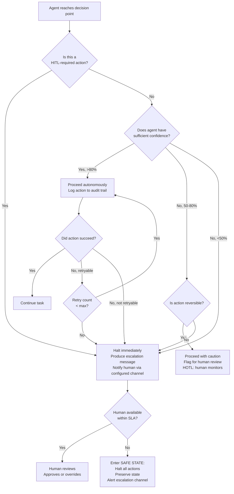

# Escalation Paths

This document defines how agents escalate to humans — what triggers escalation, how escalations are communicated, what SLAs apply, and what agents must do if no human is available.

---

## Escalation Decision Tree



---

## Standard Escalation Triggers

These conditions always require escalation, regardless of autonomy tier:

### Mandatory Escalation Triggers (Any Agent)

| Trigger | Condition | Urgency |
|---|---|---|
| **HITL action type** | The planned action is classified as HITL in the governance model | P1 |
| **Security finding** | Agent detects potential security vulnerability, hardcoded secret, or SQL injection risk | P1 |
| **Data destructive operation** | Any delete, truncate, drop, or bulk update operation against non-test data | P1 |
| **ADR conflict** | Implementation would violate an accepted ADR compliance rule | P2 |
| **Conflicting requirements** | Two or more spec sections or ADRs contradict each other | P2 |
| **Missing context** | A required context file is missing, empty, or clearly stale (>90 days) | P2 |
| **Confidence below threshold** | Agent's self-assessed confidence in correctness < 50% | P2 |
| **Change size exceeded** | Single task implementation exceeds 500 lines changed without test coverage | P2 |
| **Test failure after retries** | Tests fail after 3 retry attempts and agent cannot determine root cause | P2 |
| **External service unavailable** | A required external service (DB, API, broker) is unreachable and task requires it | P3 |
| **No test coverage possible** | Acceptance criteria cannot be expressed as automated tests | P3 |
| **Circular dependency detected** | Architecture mapping reveals circular service dependency | P3 |
| **Shared database detected** | Multiple services writing to same database (anti-pattern) | P3 |
| **Stale documentation** | Doc Agent finds documentation >3 years old or clearly contradicting code | P3 |
| **Codebase too large** | Discovery Agent encounters codebase >500k LOC | P3 |

---

## Escalation Message Format

All escalations must use this exact format. Do not summarise or truncate — humans need full context to make good decisions quickly.

```markdown
## 🚨 ESCALATION — {URGENCY: P1|P2|P3}

**Agent:** {agent_id}
**Product:** {product_id}
**Phase:** {onboarding|spec|build|ops}
**Task:** {task_id or description}
**Timestamp:** {ISO 8601}
**Trigger:** {exact trigger condition from the list above}

---

### What I Was Doing
{1-3 sentences describing the task the agent was executing when the escalation was triggered}

### What I Found
{Clear, specific description of the finding that requires human judgment.
Include file paths, line numbers, specific values — not vague descriptions.}

### Why This Requires Human Judgment
{Explain why this cannot be resolved autonomously: missing authority, risk level, ambiguity, etc.}

### Options Available
1. **{Option A}** — Consequences: {what happens if this option is chosen}
2. **{Option B}** — Consequences: {what happens if this option is chosen}
3. **Provide new instruction** — I will implement whatever you specify

### My Recommendation
{If agent has a recommendation, state it clearly with rationale. If genuinely uncertain, say so.}

### Current State
{Summary of work completed before the escalation. Is it safe to resume from this point? Are any partial changes staged?}

### To Unblock Me
{Exactly what the human needs to do or say to allow the agent to continue}

---
*Agent will wait in SAFE STATE until this escalation is resolved.*
```

---

## Response SLAs by Urgency

| Urgency | Definition | Response SLA | Escalation Channel |
|---|---|---|---|
| **P1** | Agent has halted; production is at risk or destructive action is pending | 15 minutes | Pager / phone call |
| **P2** | Agent has halted; development is blocked; no immediate production risk | 2 hours (business hours) | Slack / Teams DM + email |
| **P3** | Agent has flagged a concern; is waiting for next available human review | Next business day | Slack / Teams channel |

**Outside business hours:**
- P1 escalations are always paged — configure on-call rotation for the Ops/Platform role
- P2 and P3 escalations queue until next business day unless the Orchestrator has defined an out-of-hours escalation policy

---

## Safe State Rules

When an agent escalates and no human is available within the SLA, the agent must enter **Safe State**:

### Safe State Definition

> The agent has completely halted all operations, preserved all work completed so far, and will not take any further action until a human explicitly resumes it.

### Safe State Rules (Non-Negotiable)

1. **No forward progress** — The agent takes zero additional actions, including "small" or "safe-seeming" ones
2. **State preservation** — All work completed before the escalation is committed to version control (as a draft branch, not merged)
3. **Clear documentation** — The agent writes a `ESCALATION.md` file in the product's working directory summarising the state
4. **No timeout auto-resume** — The agent does not auto-resume after a timeout. A human must explicitly instruct it to resume.
5. **No partial deployments** — If a deployment was in progress, the agent does not proceed to the next stage
6. **Audit log entry** — Safe state entry is always logged with full context

### `ESCALATION.md` written to product directory:
```markdown
# ⚠️ Agent in Safe State

**Agent:** {agent_id}
**Since:** {timestamp}
**Trigger:** {summary}

## Work Completed Before Halt
{List of files created/modified}

## Work Remaining
{What was left to do}

## To Resume
Say: "Resume from escalation — [your decision]"
Or: Run the relevant agent with the updated context.

## Draft Branch
{branch name if code was staged}
```

---

## Escalation Logging Requirements

Every escalation must be logged to the audit trail regardless of outcome.

**Required log fields:**
```json
{
  "timestamp": "ISO 8601",
  "event_type": "ESCALATION",
  "agent_id": "string",
  "product_id": "string",
  "phase": "string",
  "task_id": "string",
  "trigger": "string",
  "urgency": "P1|P2|P3",
  "human_reviewer": "string or null",
  "resolution": "approved|rejected|modified|pending",
  "resolution_timestamp": "ISO 8601 or null",
  "resolution_notes": "string",
  "time_to_resolution_minutes": "number or null",
  "safe_state_entered": "boolean"
}
```

Logs are written to:
- GCP Cloud Logging (GKE workloads): log name `pdlc-agent-escalations`
- On-premise (VCF workloads): syslog → Splunk index `pdlc_audit`

---

## Escalation Review in Quarterly Pod Review

Escalation data feeds directly into the pod health review:

- **Escalation frequency trend** — rising escalations indicate declining context quality or spec gaps
- **Resolution time trend** — measures team responsiveness; long resolution times indicate insufficient staffing or unclear ownership
- **Repeated escalation triggers** — same trigger appearing >3 times in a quarter → process/spec/ADR gap to fix
- **Safe state frequency** — any safe state outside of planned downtime windows is a process failure to investigate

---

*Last updated: 2026-06 | Owner: Orchestrator + Architect | Review cadence: Quarterly*
