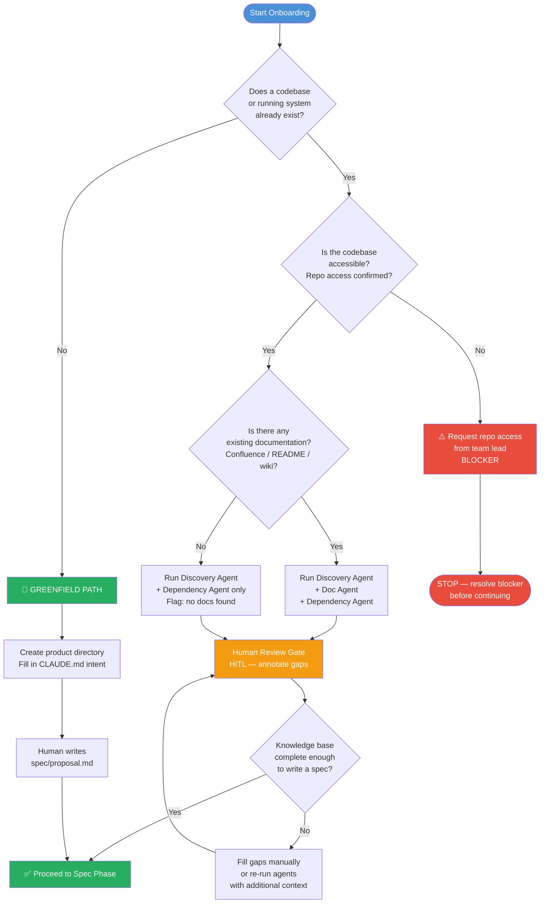

# Onboarding Phase

> **Phase position:** Entry point → Onboarding → Spec → Design → Build → Verify → Release
>
> **Target duration:** ≤ 5 working days
>
> **Runbook:** [runbook.md](./runbook.md)

---

## Purpose

The Onboarding Phase produces a **structured product knowledge base** that all downstream agents and human engineers will reference throughout the PDLC. It is the foundation on which accurate specs, safe designs, and meaningful tests are built.

There are **two distinct entry points** into this phase depending on whether a product already exists:

| Entry Point | Situation | Human Effort | Agent Effort |
|-------------|-----------|--------------|--------------|
| **Discovery Path** | Existing product / service with a live codebase | Review & annotate agent outputs | High — agents interrogate codebase, docs, and dependencies |
| **Greenfield Path** | No existing product — new build from scratch | Write `proposal.md` directly | Low at this stage — heavy agent involvement begins at Spec Phase |

Completing this phase correctly means every subsequent phase operates from shared, verified facts rather than assumptions.

---

## Entry Points Explained

### 🔍 Discovery Path — Existing Product

Use this path when you are onboarding a **product that already exists**: a running microservice, a legacy monolith, an ETL pipeline, or any system that has a codebase and potentially some documentation.

**What happens:**
1. A human engineer seeds the product directory and fills in known context.
2. Three specialised agents run in sequence — **Discovery Agent**, **Doc Agent**, **Dependency Agent** — each producing a structured output document.
3. A human review gate (HITL) validates agent outputs, annotates gaps, and confirms the knowledge base is accurate before proceeding.

**Outputs produced:**
- `discovery/discovery-report.md` — full codebase and tech stack snapshot
- `discovery/domain-glossary.md` — domain language extracted from documentation
- `discovery/architecture-map.md` — service topology, blast radius, data flows
- `discovery/interface-inventory.md` — all inbound/outbound interfaces catalogued

**Proceed to:** Spec Phase, informed by a complete knowledge base.

---

### 🌱 Greenfield Path — New Product

Use this path when you are building something **from scratch**: no legacy codebase, no existing system to reverse-engineer.

**What happens:**
1. A human engineer creates the product directory and fills in intent context.
2. The human (or product team) writes `spec/proposal.md` directly, capturing what is to be built, the problem it solves, and the target service type.
3. No discovery agents run — there is nothing to discover yet.

**Outputs produced:**
- `spec/proposal.md` — the product proposal, seeding the Spec Phase

**Proceed to:** Spec Phase directly, where an agent team will elaborate the proposal into a full spec.

---

## Decision Tree

Use the following diagram to determine which path applies:

---

## What the Onboarding Phase Produces

### Discovery Path Outputs

| Output File | Produced By | Location | Used By |
|---|---|---|---|
| `discovery-report.md` | Discovery Agent | `products/<name>/discovery/` | Spec Agent, Design Agent |
| `domain-glossary.md` | Doc Agent | `products/<name>/discovery/` | Spec Agent, all agents |
| `architecture-map.md` | Dependency Agent | `products/<name>/discovery/` | Design Agent, Test Agent |
| `interface-inventory.md` | Dependency Agent | `products/<name>/discovery/` | Design Agent, Spec Agent |
| `CLAUDE.md` | Human | `products/<name>/` | All agents (context injection) |

### Greenfield Path Outputs

| Output File | Produced By | Location | Used By |
|---|---|---|---|
| `proposal.md` | Human | `products/<name>/spec/` | Spec Agent |
| `CLAUDE.md` | Human | `products/<name>/` | All agents (context injection) |

---

## Time Estimate

| Activity | Discovery Path | Greenfield Path |
|---|---|---|
| Repo access & directory setup | 0.5 days | 0.5 days |
| Discovery Agent run | 1–2 hours (automated) | N/A |
| Doc Agent run | 1–2 hours (automated) | N/A |
| Dependency Agent run | 1–2 hours (automated) | N/A |
| Human review gate | 1–2 days | N/A |
| Writing proposal.md | N/A | 1–2 days |
| Gap-filling / re-runs | 0–1 day | N/A |
| **Total target** | **≤ 5 working days** | **≤ 2 working days** |

> [!IMPORTANT]
> The 5-day target assumes repo access is granted on Day 1. Delays in access provisioning are the most common blocker — escalate immediately if access is not confirmed within 4 working hours of starting.

---

## Prerequisites

### All Paths

- [ ] Product name agreed and follows naming convention: `kebab-case`, ≤ 32 characters
- [ ] `products/<product-name>/` directory created from template (`products/_template/`)
- [ ] `products/<product-name>/CLAUDE.md` seeded with known context
- [ ] Engineer assigned as **Onboarding Owner** (single accountable person for this phase)

### Discovery Path Only

- [ ] Read access to the product's source code repository (Git clone or browse access)
- [ ] Known tech stack hint (even partial: "Java Spring Boot", "Python FastAPI", etc.)
- [ ] Confirmation of service type: `api` | `microservice` | `monolith` | `data-pipeline`
- [ ] Access to documentation sources (Confluence space, wiki, README files)
- [ ] (Optional) OpenAPI / Swagger spec URL if the service publishes one
- [ ] (Optional) Running environment access for Actuator endpoint probing
- [ ] (Optional) Kubernetes namespace name if deployed on GKE
- [ ] (Optional) Harness pipeline credentials for automated discovery pipeline trigger

### Greenfield Path Only

- [ ] Product proposal drafted by product owner (even rough notes suffice as input)
- [ ] Service type decided: `api` | `microservice` | `monolith` | `data-pipeline`
- [ ] Target infrastructure identified: `GCP GKE` | `VMware VCF` | `hybrid`
- [ ] Primary runtime confirmed: Java 21 + Spring Boot 3.x (or documented exception)

---

## Next Steps

Once the Onboarding Phase is complete:

1. Confirm all output files exist and have been reviewed by the Onboarding Owner.
2. Move the `discovery/` outputs to read-only status (tag commit: `onboarding-complete`).
3. Hand off to the **Spec Phase** — see `spec/README.md`.
4. The Spec Agent will automatically load `CLAUDE.md` and all `discovery/` outputs as context.

---

## Related Documents

| Document | Purpose |
|---|---|
| [runbook.md](./runbook.md) | Step-by-step instructions for executing this phase |
| [templates/discovery-report.md](./templates/discovery-report.md) | Template for Discovery Agent output |
| [templates/architecture-map.md](./templates/architecture-map.md) | Template for Dependency Agent output |
| [templates/domain-glossary.md](./templates/domain-glossary.md) | Template for Doc Agent output |
| [templates/interface-inventory.md](./templates/interface-inventory.md) | Template for Dependency Agent output |
| [prompts/discovery-prompt.md](./prompts/discovery-prompt.md) | Claude Code prompt for Discovery Agent |
| [prompts/doc-ingest-prompt.md](./prompts/doc-ingest-prompt.md) | Claude Code prompt for Doc Agent |
| [prompts/dep-map-prompt.md](./prompts/dep-map-prompt.md) | Claude Code prompt for Dependency Agent |
| [../framework/agents/onboarding/discovery-agent.md](../framework/agents/onboarding/discovery-agent.md) | Discovery Agent definition |
| [../framework/agents/onboarding/doc-agent.md](../framework/agents/onboarding/doc-agent.md) | Doc Agent definition |
| [../framework/agents/onboarding/dependency-agent.md](../framework/agents/onboarding/dependency-agent.md) | Dependency Agent definition |
