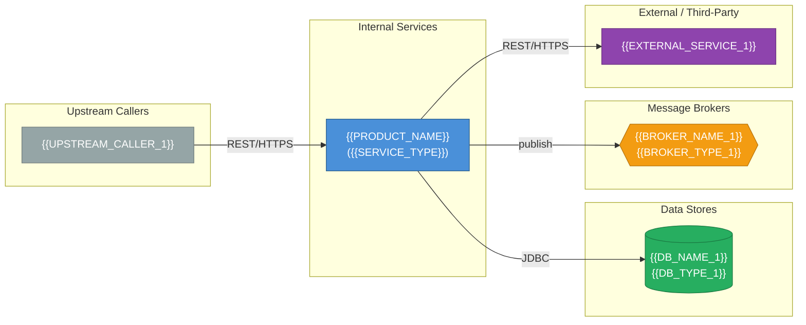

# Architecture Map — {{PRODUCT_NAME}}

> **Generated by:** Dependency Agent (PDLC Framework)
>
> **Date:** {{ARCHITECTURE_MAP_DATE}}
>
> **Input:** `{{DISCOVERY_REPORT_PATH}}`
>
> **Agent version:** {{AGENT_VERSION}}
>
> **Status:** DRAFT — requires human review

---

## 1. Service Topology Diagram

> _[Agent: generate a Mermaid diagram showing all services, their relationships, and the protocols used. Include databases, message brokers, and external services. Use left-to-right layout. Label edges with protocol and direction.]_



### Diagram Legend

| Shape | Colour | Meaning |
|---|---|---|
| Rectangle | Blue | Internal microservice / API |
| Cylinder | Green | Database |
| Hexagon / Diamond | Amber | Message broker |
| Rectangle | Purple | External / third-party service |
| Rectangle | Grey | Upstream caller |

---

## 2. Component Inventory

> _[Agent: list every component that interacts with or is part of the product. One row per component.]_

| Component Name | Type | Technology | Version | Deployment Target | Owner Team | Notes |
|---|---|---|---|---|---|---|
| `{{PRODUCT_NAME}}` | {{SERVICE_TYPE}} | Java {{JAVA_VERSION}}, Spring Boot {{SB_VERSION}} | {{APP_VERSION}} | {{DEPLOYMENT_TARGET}} | {{TEAM}} | Primary subject of this report |
| `{{COMPONENT_2}}` | {{COMPONENT_2_TYPE}} _(microservice / database / broker / gateway / CDN / etc.)_ | {{COMPONENT_2_TECH}} | {{COMPONENT_2_VERSION}} | {{COMPONENT_2_DEPLOY}} | {{COMPONENT_2_TEAM}} | {{COMPONENT_2_NOTES}} |
| `{{DB_NAME_1}}` | Database | {{DB_TYPE_1}} {{DB_VERSION_1}} | {{DB_SCHEMA_VERSION}} | {{DB_DEPLOY}} | {{DB_TEAM}} | {{DB_NOTES}} |
| _..._ | | | | | | |

---

## 3. Dependency Matrix

> _[Agent: document every directional dependency. A depends on B = A calls B / A reads from B / A publishes to B. Flag shared dependencies (same resource consumed by multiple services) with ⚠️.]_

### 3.1 Service-to-Service Dependencies

| From | To | Protocol | Auth | Sync / Async | Criticality | Notes |
|---|---|---|---|---|---|---|
| `{{PRODUCT_NAME}}` | `{{DOWNSTREAM_SVC_1}}` | {{PROTOCOL_1}} _(REST / gRPC / SOAP)_ | {{AUTH_1}} | {{SYNC_ASYNC_1}} | {{CRITICALITY_1}} _(High / Medium / Low)_ | {{DEP_NOTES_1}} |
| `{{UPSTREAM_SVC_1}}` | `{{PRODUCT_NAME}}` | {{UPSTREAM_PROTOCOL_1}} | {{UPSTREAM_AUTH_1}} | {{UPSTREAM_SYNC_1}} | {{UPSTREAM_CRITICALITY_1}} | {{UPSTREAM_NOTES_1}} |
| _..._ | | | | | | |

### 3.2 Service-to-Data Dependencies

| Service | Data Store | Access Type | Schema / Database | Tables / Collections | Notes |
|---|---|---|---|---|---|
| `{{PRODUCT_NAME}}` | `{{DB_NAME_1}}` | {{DB_ACCESS_TYPE}} _(read-write / read-only / write-only)_ | `{{SCHEMA_NAME}}` | {{TABLES_LIST}} | {{DB_DEP_NOTES}} |
| `{{OTHER_SVC}}` | `{{DB_NAME_1}}` | {{OTHER_DB_ACCESS}} | `{{OTHER_SCHEMA}}` | {{OTHER_TABLES}} | ⚠️ Shared database — see concerns |
| _..._ | | | | | |

### 3.3 Service-to-Broker Dependencies

| Service | Broker | Topic / Queue | Role | Message Schema | Notes |
|---|---|---|---|---|---|
| `{{PRODUCT_NAME}}` | {{BROKER_TYPE}} | `{{TOPIC_1}}` | {{BROKER_ROLE_1}} _(producer / consumer)_ | `{{MESSAGE_SCHEMA_1}}` | {{BROKER_DEP_NOTES_1}} |
| _..._ | | | | | |

---

## 4. API Contract Inventory

> _[Agent: document every inbound API endpoint. Reference OpenAPI spec if available. If OpenAPI spec not found, reconstruct from @RestController scanning.]_

### 4.1 Inbound REST Endpoints

| Endpoint Path | HTTP Method | Auth Required | Request Schema | Response Schema | Controller | OpenAPI Ref | Notes |
|---|---|---|---|---|---|---|---|
| `{{ENDPOINT_PATH_1}}` | {{HTTP_METHOD_1}} | {{AUTH_REQUIRED_1}} | {{REQUEST_SCHEMA_1}} | {{RESPONSE_SCHEMA_1}} | `{{CONTROLLER_1}}` | {{OPENAPI_REF_1}} | {{ENDPOINT_NOTES_1}} |
| _..._ | | | | | | | |

### 4.2 OpenAPI Specification

| Field | Value |
|---|---|
| **OpenAPI available** | {{OPENAPI_AVAILABLE}} _(Yes / No)_ |
| **Spec URL** | {{OPENAPI_URL}} _(e.g., `/v3/api-docs`)_ |
| **Spec file** | {{OPENAPI_FILE}} _(path in repo if committed)_ |
| **springdoc version** | {{SPRINGDOC_VERSION}} |
| **UI available** | {{SWAGGER_UI_AVAILABLE}} _(Swagger UI at `/swagger-ui.html`)_ |

---

## 5. Data Flow Descriptions

> _[Agent: describe the key data flows through the system. For each flow, trace the request from entry to persistence/response. Use numbered steps.]_

### Flow 1: {{FLOW_1_NAME}}

> _Example: "User creates an order"_

**Trigger:** {{FLOW_1_TRIGGER}}

1. {{FLOW_1_STEP_1}}
2. {{FLOW_1_STEP_2}}
3. {{FLOW_1_STEP_3}}
4. {{FLOW_1_STEP_4}}
5. {{FLOW_1_STEP_5}}

**Data stores touched:** {{FLOW_1_DATASTORES}}
**Events published:** {{FLOW_1_EVENTS}}
**External services called:** {{FLOW_1_EXTERNAL}}

---

### Flow 2: {{FLOW_2_NAME}}

**Trigger:** {{FLOW_2_TRIGGER}}

1. {{FLOW_2_STEP_1}}
2. {{FLOW_2_STEP_2}}
3. {{FLOW_2_STEP_3}}

**Data stores touched:** {{FLOW_2_DATASTORES}}
**Events published:** {{FLOW_2_EVENTS}}
**External services called:** {{FLOW_2_EXTERNAL}}

---

_[Agent: add additional flows as needed. Aim to cover at least: main happy path, key error path, any async/background flows.]_

---

## 6. Blast Radius Analysis

> _[Agent: for each component, determine what breaks if it becomes unavailable. Consider: which services depend on it, is there a fallback, is the dependency synchronous (hard failure) or async (degraded), what % of user journeys are affected.]_

| Component | Services That Depend On It | Failure Mode | User Impact | Fallback Exists? | Blast Radius |
|---|---|---|---|---|---|
| `{{PRODUCT_NAME}}` | {{DEPENDENTS_OF_PRODUCT}} | {{PRODUCT_FAILURE_MODE}} | {{PRODUCT_USER_IMPACT}} | {{PRODUCT_FALLBACK}} | {{PRODUCT_BLAST_RADIUS}} _(Low / Medium / High / Critical)_ |
| `{{DB_NAME_1}}` | {{DB_DEPENDENTS}} | {{DB_FAILURE_MODE}} _(connection timeout / connection refused)_ | {{DB_USER_IMPACT}} | {{DB_FALLBACK}} _(read replica / cache / none)_ | {{DB_BLAST_RADIUS}} |
| `{{DOWNSTREAM_SVC_1}}` | {{DOWNSTREAM_DEPENDENTS}} | {{DOWNSTREAM_FAILURE_MODE}} | {{DOWNSTREAM_USER_IMPACT}} | {{DOWNSTREAM_FALLBACK}} _(circuit breaker / fallback response / none)_ | {{DOWNSTREAM_BLAST_RADIUS}} |
| `{{BROKER_NAME_1}}` | {{BROKER_DEPENDENTS}} | {{BROKER_FAILURE_MODE}} | {{BROKER_USER_IMPACT}} | {{BROKER_FALLBACK}} | {{BROKER_BLAST_RADIUS}} |
| _..._ | | | | | |

### Blast Radius Legend

| Level | Meaning |
|---|---|
| **Critical** | Complete service outage, all user journeys affected, no fallback |
| **High** | Major functionality unavailable, most user journeys degraded |
| **Medium** | Partial functionality unavailable, some user journeys affected |
| **Low** | Minor degradation, most user journeys unaffected, or fallback exists |

---

## 7. Infrastructure Deployment Map

> _[Agent: map each component to its deployment target. Distinguish between GCP GKE (containerised) and VMware VCF (VM-based). If unknown, mark as such.]_

### 7.1 GCP GKE Components

| Component | Kubernetes Namespace | Deployment Name | Replicas | Node Pool | GCP Region | Notes |
|---|---|---|---|---|---|---|
| `{{GKE_COMPONENT_1}}` | `{{GKE_NAMESPACE_1}}` | `{{GKE_DEPLOYMENT_1}}` | {{GKE_REPLICAS_1}} | {{GKE_NODE_POOL_1}} | {{GKE_REGION_1}} | {{GKE_NOTES_1}} |
| _..._ | | | | | | |

### 7.2 VMware VCF Components

| Component | VM Name / Pattern | vSphere Cluster | Resource Pool | Network | Notes |
|---|---|---|---|---|---|
| `{{VCF_COMPONENT_1}}` | `{{VCF_VM_1}}` | `{{VCF_CLUSTER_1}}` | `{{VCF_RESOURCE_POOL_1}}` | `{{VCF_NETWORK_1}}` | {{VCF_NOTES_1}} |
| _..._ | | | | | |

### 7.3 Shared / Managed Services

| Service | Provider | Type | Region / Location | Notes |
|---|---|---|---|---|
| `{{MANAGED_SVC_1}}` | {{MANAGED_PROVIDER_1}} _(GCP / VMware / third-party)_ | {{MANAGED_TYPE_1}} _(Cloud SQL / Pub/Sub / NSX-T / etc.)_ | {{MANAGED_REGION_1}} | {{MANAGED_NOTES_1}} |
| _..._ | | | | |

---

## 8. External Dependencies and SLA

> _[Agent: document all external dependencies (outside the internal platform) with their SLA characteristics and criticality to the product.]_

| Dependency | Type | Owner / Vendor | SLA (Availability) | RTO | RPO | Criticality | Fallback | Notes |
|---|---|---|---|---|---|---|---|---|
| `{{EXT_DEP_1}}` | {{EXT_DEP_TYPE_1}} _(API / database / auth provider / etc.)_ | {{EXT_DEP_OWNER_1}} | {{EXT_DEP_SLA_1}} | {{EXT_DEP_RTO_1}} | {{EXT_DEP_RPO_1}} | {{EXT_DEP_CRITICALITY_1}} | {{EXT_DEP_FALLBACK_1}} | {{EXT_DEP_NOTES_1}} |
| _..._ | | | | | | | | |

---

## 9. Architecture Patterns Identified

> _[Agent: identify the dominant architecture patterns in use. Provide evidence (file locations / class names) for each pattern identified.]_

| Pattern | Identified? | Evidence | Notes |
|---|---|---|---|
| **Layered (n-tier)** | {{PATTERN_LAYERED}} _(Yes / No / Partial)_ | {{PATTERN_LAYERED_EVIDENCE}} | {{PATTERN_LAYERED_NOTES}} |
| **Hexagonal (Ports & Adapters)** | {{PATTERN_HEXAGONAL}} | {{PATTERN_HEXAGONAL_EVIDENCE}} | {{PATTERN_HEXAGONAL_NOTES}} |
| **Event-Driven** | {{PATTERN_EVENT_DRIVEN}} | {{PATTERN_EVENT_DRIVEN_EVIDENCE}} | {{PATTERN_EVENT_DRIVEN_NOTES}} |
| **CQRS** | {{PATTERN_CQRS}} | {{PATTERN_CQRS_EVIDENCE}} | {{PATTERN_CQRS_NOTES}} |
| **Saga** | {{PATTERN_SAGA}} | {{PATTERN_SAGA_EVIDENCE}} | {{PATTERN_SAGA_NOTES}} |
| **Circuit Breaker** | {{PATTERN_CIRCUIT_BREAKER}} | {{PATTERN_CB_EVIDENCE}} _(Resilience4j / Hystrix)_ | {{PATTERN_CB_NOTES}} |
| **API Gateway** | {{PATTERN_GATEWAY}} | {{PATTERN_GATEWAY_EVIDENCE}} | {{PATTERN_GATEWAY_NOTES}} |
| **Outbox Pattern** | {{PATTERN_OUTBOX}} | {{PATTERN_OUTBOX_EVIDENCE}} | {{PATTERN_OUTBOX_NOTES}} |

---

## 10. Architecture Concerns and Debt

> _[Agent: flag all architectural concerns found during analysis. Each concern should cite evidence.]_

| ID | Concern | Severity | Evidence | Recommendation |
|---|---|---|---|---|
| AC-001 | {{CONCERN_1}} | {{CONCERN_1_SEVERITY}} _(Critical / High / Medium / Low)_ | {{CONCERN_1_EVIDENCE}} | {{CONCERN_1_RECOMMENDATION}} |
| AC-002 | {{CONCERN_2}} | {{CONCERN_2_SEVERITY}} | {{CONCERN_2_EVIDENCE}} | {{CONCERN_2_RECOMMENDATION}} |
| _..._ | | | | |

> _Common concerns to check for:_
> - _Shared database between services (breaks service isolation)_
> - _Synchronous chains longer than 3 hops (latency / failure amplification)_
> - _No circuit breaker on critical external calls_
> - _Single point of failure with no fallback_
> - _Missing API versioning strategy_
> - _Hardcoded service URLs (configuration management concern)_
> - _Missing distributed tracing_

---

## 11. Human Review Notes

> _[To be filled in by the Onboarding Owner after reviewing this map.]_

**Reviewed by:** {{REVIEWER_NAME}}
**Review date:** {{REVIEW_DATE}}

### Annotations

```
- [CONFIRMED] <what was confirmed correct>
- [CORRECTION] <what was wrong and what the correct value is>
- [GAP] <what is missing>
- [CONCERN] <architectural concern to carry into Design Phase>
```

{{HUMAN_REVIEW_ANNOTATIONS}}

### Sign-off

- **Status:** APPROVED / APPROVED WITH GAPS / REJECTED
- **Sign-off by:** {{SIGNOFF_NAME}}
- **Date:** {{SIGNOFF_DATE}}
