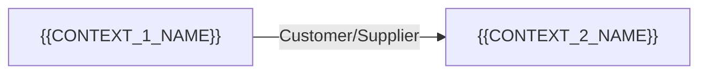

# Domain Glossary — {{PRODUCT_NAME}}

> **Generated by:** Doc Agent (PDLC Framework)
>
> **Date:** {{GLOSSARY_DATE}}
>
> **Documentation sources ingested:**
> {{DOC_SOURCES_LIST}}
>
> **Agent version:** {{AGENT_VERSION}}
>
> **Status:** DRAFT — requires human review

---

## 1. Bounded Contexts

> _[Agent: identify distinct bounded contexts within the product. A bounded context is a boundary within which a particular domain model applies. For simple products with a single domain, there may be only one context. For complex products or platforms, there may be several.]_

| Context ID | Context Name | Description | Primary Team | Key Entities | Notes |
|---|---|---|---|---|---|
| `{{CTX_1}}` | {{CONTEXT_1_NAME}} | {{CONTEXT_1_DESC}} | {{CONTEXT_1_TEAM}} | {{CONTEXT_1_ENTITIES}} | {{CONTEXT_1_NOTES}} |
| `{{CTX_2}}` | {{CONTEXT_2_NAME}} | {{CONTEXT_2_DESC}} | {{CONTEXT_2_TEAM}} | {{CONTEXT_2_ENTITIES}} | {{CONTEXT_2_NOTES}} |
| _..._ | | | | | |

### Context Map

> _[Agent: if multiple bounded contexts exist, produce a Mermaid context map showing relationships — Shared Kernel, Customer/Supplier, Conformist, Anti-Corruption Layer, Open Host Service, etc.]_



---

## 2. Domain Term Glossary

> _[Agent: extract all domain terms from documentation, code comments, class names, method names, and API endpoint paths. For each term, provide a definition grounded in the documentation. If the term is used inconsistently, flag the inconsistency.]_

### A

| Term | Definition | Bounded Context | Code Locations | Source | Notes |
|---|---|---|---|---|---|
| {{TERM_A1}} | {{TERM_A1_DEFINITION}} | `{{TERM_A1_CONTEXT}}` | `{{TERM_A1_CODE_LOCATIONS}}` | {{TERM_A1_SOURCE}} | {{TERM_A1_NOTES}} |
| _..._ | | | | | |

### B

| Term | Definition | Bounded Context | Code Locations | Source | Notes |
|---|---|---|---|---|---|
| {{TERM_B1}} | {{TERM_B1_DEFINITION}} | `{{TERM_B1_CONTEXT}}` | `{{TERM_B1_CODE_LOCATIONS}}` | {{TERM_B1_SOURCE}} | {{TERM_B1_NOTES}} |
| _..._ | | | | | |

### C

| Term | Definition | Bounded Context | Code Locations | Source | Notes |
|---|---|---|---|---|---|
| {{TERM_C1}} | {{TERM_C1_DEFINITION}} | `{{TERM_C1_CONTEXT}}` | `{{TERM_C1_CODE_LOCATIONS}}` | {{TERM_C1_SOURCE}} | {{TERM_C1_NOTES}} |
| _..._ | | | | | |

_[Agent: continue for all letters present in the domain vocabulary. Only include letters where terms exist — skip empty letters.]_

---

## 3. Key Business Rules

> _[Agent: extract all explicitly stated business rules from documentation, Confluence pages, and code comments. Number them sequentially. If a business rule is implemented in code, cite the class/method. If a rule is documented but NOT implemented (or vice versa), flag the gap.]_

| ID | Business Rule | Source | Implementation | Context | Notes |
|---|---|---|---|---|---|
| BR-001 | {{RULE_1}} | {{RULE_1_SOURCE}} _(Confluence page / README / code comment)_ | `{{RULE_1_IMPL}}` _(class#method or "not found in code")_ | `{{RULE_1_CONTEXT}}` | {{RULE_1_NOTES}} |
| BR-002 | {{RULE_2}} | {{RULE_2_SOURCE}} | `{{RULE_2_IMPL}}` | `{{RULE_2_CONTEXT}}` | {{RULE_2_NOTES}} |
| BR-003 | {{RULE_3}} | {{RULE_3_SOURCE}} | `{{RULE_3_IMPL}}` | `{{RULE_3_CONTEXT}}` | {{RULE_3_NOTES}} |
| _..._ | | | | | |

> _Examples of business rules:_
> - _"An order can only be cancelled if its status is PENDING or PROCESSING"_
> - _"A customer must have a verified email address before placing their first order"_
> - _"Refunds must be processed within 5 business days"_
> - _"A payment must not be retried more than 3 times"_

---

## 4. Domain Events

> _[Agent: document all domain events — things that happen in the domain that other parts of the system or other services care about. Distinguish between events found in code (concrete) and events described only in documentation (abstract).]_

| Event Name | Trigger / Cause | Producer | Consumers | Broker | Topic / Queue | Message Schema | Status |
|---|---|---|---|---|---|---|---|
| `{{EVENT_1}}` | {{EVENT_1_TRIGGER}} | `{{EVENT_1_PRODUCER}}` | {{EVENT_1_CONSUMERS}} | {{EVENT_1_BROKER}} _(Kafka / Pub/Sub / RabbitMQ / internal)_ | `{{EVENT_1_TOPIC}}` | `{{EVENT_1_SCHEMA}}` | {{EVENT_1_STATUS}} _(Implemented / Documented only / Planned)_ |
| `{{EVENT_2}}` | {{EVENT_2_TRIGGER}} | `{{EVENT_2_PRODUCER}}` | {{EVENT_2_CONSUMERS}} | {{EVENT_2_BROKER}}  | `{{EVENT_2_TOPIC}}` | `{{EVENT_2_SCHEMA}}` | {{EVENT_2_STATUS}} |
| _..._ | | | | | | | |

### Event Schema Registry

> _[If a schema registry is in use (e.g., Google Apigee Schema Registry, Confluent Schema Registry, AWS Glue), reference it here.]_

| Field | Value |
|---|---|
| **Schema registry in use** | {{SCHEMA_REGISTRY}} _(Yes / No)_ |
| **Registry type** | {{SCHEMA_REGISTRY_TYPE}} _(Confluent / Apigee / AWS Glue / none)_ |
| **Registry URL** | {{SCHEMA_REGISTRY_URL}} |
| **Schema format** | {{SCHEMA_FORMAT}} _(Avro / Protobuf / JSON Schema / none)_ |

---

## 5. Abbreviations and Acronyms

> _[Agent: extract all abbreviations and acronyms used in code identifiers, documentation, API paths, and database column names. Include both domain-specific and system-specific acronyms.]_

| Abbreviation / Acronym | Full Form | Context | Notes |
|---|---|---|---|
| {{ACRONYM_1}} | {{ACRONYM_1_FULL}} | {{ACRONYM_1_CONTEXT}} | {{ACRONYM_1_NOTES}} |
| {{ACRONYM_2}} | {{ACRONYM_2_FULL}} | {{ACRONYM_2_CONTEXT}} | {{ACRONYM_2_NOTES}} |
| _..._ | | | |

---

## 6. Naming Inconsistencies

> _[Agent: flag cases where the same concept is named differently in code vs documentation, or where different parts of the codebase use different names for the same thing. These inconsistencies indicate areas of domain model confusion and should be resolved before the Spec Phase.]_

> [!WARNING]
> Naming inconsistencies are a signal of domain model debt. Each inconsistency should be reviewed and a canonical term agreed upon before proceeding.

| ID | Concept | Name in Code | Name in Docs | Name in API | Name in DB | Recommendation |
|---|---|---|---|---|---|---|
| NI-001 | {{INCONSISTENCY_1_CONCEPT}} | `{{INCONSISTENCY_1_CODE}}` | `{{INCONSISTENCY_1_DOCS}}` | `{{INCONSISTENCY_1_API}}` | `{{INCONSISTENCY_1_DB}}` | {{INCONSISTENCY_1_RECOMMENDATION}} |
| NI-002 | {{INCONSISTENCY_2_CONCEPT}} | `{{INCONSISTENCY_2_CODE}}` | `{{INCONSISTENCY_2_DOCS}}` | `{{INCONSISTENCY_2_API}}` | `{{INCONSISTENCY_2_DB}}` | {{INCONSISTENCY_2_RECOMMENDATION}} |
| _..._ | | | | | | |

> _Examples of inconsistencies to look for:_
> - _Code says `Customer`, docs say `Client`, API says `Account`_
> - _Code uses `status` field, DB column is named `state`_
> - _Docs call it "order processing", code method is named `handleTransaction()`_
> - _One controller uses camelCase query params, another uses snake_case_

---

## 7. Operational and Non-Functional Knowledge

> _[Agent: extract operational context from runbooks, incident reports, and ops documentation. This informs the Spec Phase's non-functional requirements.]_

### 7.1 Known SLAs / SLOs

| Metric | Target | Source | Notes |
|---|---|---|---|
| Availability | {{SLA_AVAILABILITY}} | {{SLA_AVAILABILITY_SOURCE}} | {{SLA_AVAILABILITY_NOTES}} |
| Latency (P99) | {{SLA_LATENCY_P99}} | {{SLA_LATENCY_SOURCE}} | {{SLA_LATENCY_NOTES}} |
| Throughput (RPS) | {{SLA_THROUGHPUT}} | {{SLA_THROUGHPUT_SOURCE}} | {{SLA_THROUGHPUT_NOTES}} |
| Error rate | {{SLA_ERROR_RATE}} | {{SLA_ERROR_SOURCE}} | {{SLA_ERROR_NOTES}} |
| _..._ | | | |

### 7.2 Known Incidents and Recurring Issues

> _[Agent: if incident reports or post-mortems are available in the documentation sources, summarise recurring themes here.]_

| Incident Theme | Frequency | Root Cause (if known) | Mitigation in Place | Notes |
|---|---|---|---|---|
| {{INCIDENT_1}} | {{INCIDENT_1_FREQUENCY}} | {{INCIDENT_1_ROOT_CAUSE}} | {{INCIDENT_1_MITIGATION}} | {{INCIDENT_1_NOTES}} |
| _..._ | | | | |

### 7.3 Known Operational Dependencies

| Dependency | Type | Required For | Notes |
|---|---|---|---|
| {{OPS_DEP_1}} | {{OPS_DEP_TYPE_1}} _(cert rotation / secret rotation / batch job / manual step)_ | {{OPS_DEP_REQUIRED_FOR_1}} | {{OPS_DEP_NOTES_1}} |
| _..._ | | | |

---

## 8. Documentation Quality Assessment

> _[Agent: assess the quality and completeness of the documentation ingested. This helps the human reviewer understand how much to trust the glossary content.]_

| Dimension | Assessment | Notes |
|---|---|---|
| **Currency** | {{DOC_CURRENCY}} _(Up to date / Partially stale / Stale — >3 years old)_ | {{DOC_CURRENCY_NOTES}} |
| **Completeness** | {{DOC_COMPLETENESS}} _(Comprehensive / Partial / Minimal / None)_ | {{DOC_COMPLETENESS_NOTES}} |
| **Consistency** | {{DOC_CONSISTENCY}} _(Consistent / Minor conflicts / Major conflicts)_ | {{DOC_CONSISTENCY_NOTES}} |
| **Accuracy** | {{DOC_ACCURACY}} _(Appears accurate / Some discrepancies vs code / Major discrepancies)_ | {{DOC_ACCURACY_NOTES}} |

### Documentation Sources Assessed

| Source | Type | URL / Path | Last Updated | Quality | Notes |
|---|---|---|---|---|---|
| {{DOC_SRC_1}} | {{DOC_SRC_TYPE_1}} _(Confluence / README / Wiki / Runbook / ADR)_ | `{{DOC_SRC_URL_1}}` | {{DOC_SRC_DATE_1}} | {{DOC_SRC_QUALITY_1}} | {{DOC_SRC_NOTES_1}} |
| _..._ | | | | | |

---

## 9. Escalation Flags

> _[Agent: list all escalation flags raised during doc ingestion.]_

| Flag | Description | Action Required |
|---|---|---|
| `[ESCALATE: STALE DOCS]` | Documentation >3 years old: `{{STALE_DOC_SOURCES}}` | Human to verify currency; consider re-interviewing domain experts |
| `[ESCALATE: NO DOCS]` | No documentation found — glossary built from code analysis only | Human must review and augment with domain expert input |
| `[ESCALATE: CONFLICT]` | Code and docs conflict on `{{CONFLICT_TOPIC}}` — code is treated as ground truth | Human to confirm which is correct and update accordingly |
| _..._ | | |

---

## 10. Human Review Notes

> _[To be filled in by the Onboarding Owner and/or domain expert after reviewing this glossary.]_

**Reviewed by:** {{REVIEWER_NAME}}
**Domain expert consulted:** {{DOMAIN_EXPERT_NAME}} _(if applicable)_
**Review date:** {{REVIEW_DATE}}

### Annotations

```
- [CONFIRMED] <term or section> is accurate
- [CORRECTION] <term>: correct definition is "<correct definition>"
- [MISSING] <term> is missing — add: "<term> | <definition> | <context>"
- [INCONSISTENCY RESOLVED] NI-001: canonical term agreed: "<canonical term>"
- [BUSINESS RULE CORRECTION] BR-003: rule is wrong — correct rule is "<correct rule>"
```

{{HUMAN_REVIEW_ANNOTATIONS}}

### Sign-off

- **Status:** APPROVED / APPROVED WITH GAPS / REJECTED
- **Sign-off by:** {{SIGNOFF_NAME}}
- **Date:** {{SIGNOFF_DATE}}
