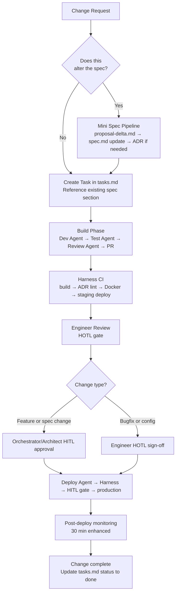

# Change Management

This document defines how all changes to a product flow through the AI-Native PDLC Framework — from the initial request through spec update, build, deployment, and post-deploy monitoring. Every change, regardless of size, must be traceable to a task, a spec section, and an ADR.

---

## Change Types

| Type | Definition | Spec Update? | ADR Update? | Human Gate |
|---|---|---|---|---|
| **Feature** | New capability defined in the spec | Yes — add/update spec section | Maybe — if new architectural decision | Orchestrator (HITL) |
| **Bugfix** | Correction to existing behaviour that deviates from spec | No | No | Engineer (HOTL) |
| **Dependency Update** | Library, framework, or base image version bump | No | Maybe — if breaking change requires architectural decision | Engineer (HOTL); Architect for breaking changes |
| **Config Change** | Non-code configuration change (env vars, feature flags, Helm values) | No | No | Ops (HOTL for staging, HITL for prod) |
| **Infrastructure Change** | GKE resource limits, HPA settings, VCF VM sizing | Maybe | Maybe | Ops + Architect (HITL) |
| **Emergency Fix** | P1 incident remediation requiring code change | Retrospectively | Retrospectively | Abbreviated process — see Emergency Fix Path |
| **ADR Update** | Superseding or deprecating an existing architectural decision | Yes (design.md) | Yes — new ADR supersedes old | Architect (HITL) |
| **Spec Refactor** | Restructuring spec without changing functionality | Yes | No | Architect (HITL) |

---

## Standard Change Flow



---

## Spec Delta Pattern

When a change requires updating the spec, use the **delta spec pattern** — a mini version of the full spec pipeline:

### Step 1 — Write a Proposal Delta
Create `products/<name>/spec/proposal-delta-{YYYY-MM-DD}.md` using this structure:

```markdown
---
product_name: {name}
delta_type: feature | adr-update | nfr-change
parent_proposal: proposal.md
status: draft | approved
author: {name}
date: {YYYY-MM-DD}
---

## Change Summary
{1-3 sentences: what is changing and why}

## Affected Spec Sections
{List spec.md section numbers that will be updated}

## New Requirements
{Numbered list of new or changed requirements}

## Removed Requirements
{Numbered list of requirements being removed or superseded}

## Affected ADRs
{List of ADR IDs that may need updating}

## Open Questions
{Any unresolved questions that block the spec update}
```

### Step 2 — Update spec.md
- Increment the `version` field in YAML frontmatter
- Update the relevant sections
- Add a change log entry at the bottom of the spec

### Step 3 — Update ADRs (if needed)
- If a new architectural decision is introduced: run ADR Agent
- If an existing ADR is superseded: update the superseded ADR's status to `superseded`, reference the new ADR ID
- New ADR must be approved (HITL: Architect) before build begins

### Step 4 — Update tasks.md
- Add new tasks for the delta change
- Mark superseded tasks as `cancelled` with a note

---

## Emergency Fix Path

For P1 incidents requiring a code change, the standard process is abbreviated. **All HITL gates are still required — they are just expedited.**

### Emergency Fix Process:

1. **Incident Agent** identifies the required code fix and documents it in the incident report
2. **Dev Agent** implements the fix (scoped strictly to the minimum change needed)
3. **Test Agent** runs targeted tests (full suite not required, but the specific failure must be covered)
4. **Review Agent** runs spec/ADR compliance check (violations may be accepted under emergency authority — see below)
5. **HITL — Emergency Authority:** Orchestrator OR Architect (either, not both required) approves the PR
6. **Deploy Agent** deploys to production via Harness expedited pipeline (stages: build → test targeted → deploy prod)
7. **HITL — Production:** Same authority level as standard
8. **Post-Incident:** Within 48 hours, the Architect must:
   - Update the spec if the fix changes documented behaviour
   - Create/update ADRs if the fix introduced a new architectural decision
   - Write the post-mortem

**Emergency ADR Override:** If the emergency fix requires violating an existing ADR (e.g., temporarily using field injection for speed), the Architect must log this override explicitly with a time-bound remediation commitment. Override expires in 5 business days.

---

## Change Freeze Process

A change freeze prevents agents from initiating new deployments to production. This is used during:
- End of financial year / reporting periods
- Major infrastructure maintenance windows
- High-traffic business events

### Activating a Freeze:
1. Orchestrator posts freeze notice to team channel with: start date, end date, affected environments
2. Update `products/<name>/CLAUDE.md` — add `change_freeze: true` to the Production Environment section
3. All agents check for `change_freeze: true` before any production deployment; they halt if found
4. Harness pipeline approval step is additionally locked to "freeze approvers" user group only

### Deactivating a Freeze:
1. Remove `change_freeze: true` from CLAUDE.md
2. Notify team
3. Review any changes that queued during the freeze; re-prioritise

---

## Change Audit Trail

Every change must be traceable through the audit log. The complete trail for any change:

```
Change Request
→ Task ID (tasks.md)
→ Spec Section Reference (spec.md#FR-NNN)
→ ADR References (ADR-NNNN)
→ PR URL (GitHub/GitLab)
→ Harness pipeline execution ID
→ Audit log entry (agent actions)
→ Human approvals (HITL records)
→ Deployment timestamp and artifact tag
→ Post-deploy health confirmation
```

This trail is queryable from the GCP Cloud Logging or Splunk audit log using `task_id` as the correlating field.

---

## Harness Change Governance Integration

Harness natively supports the governance model:

- **Deployment freeze:** Harness Freeze Windows feature; configured to block pipelines outside approved windows
- **Approval gates:** `HarnessApproval` steps in pipeline YAML with named approver groups
- **Audit trail:** Harness deployment history exports to Cloud Logging via webhook
- **Change failure tracking:** Harness deployment verification (CV) compares metrics before/after; auto-rollback on degradation

```yaml
# Example Harness pipeline YAML — production deploy with HITL gate
stages:
  - stage:
      name: Deploy to Production
      type: Deployment
      spec:
        execution:
          steps:
            - step:
                type: HarnessApproval
                name: Production Deployment Approval
                identifier: prod_approval
                spec:
                  approvers:
                    userGroups:
                      - orchestrators
                      - architects
                  message: |
                    Deploy ${imageTag} to production.
                    Task: ${taskId}
                    Spec section: ${specRef}
                    ADRs: ${adrRefs}
```

---

*Owner: Orchestrator | Review cadence: Quarterly process review*
