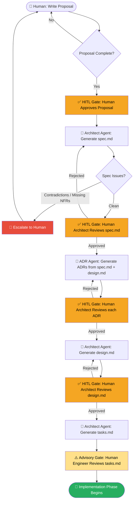

# Spec Pipeline — Detailed Reference

> **Parent:** [spec/README.md](./README.md)  
> **Purpose:** Defines every step in the proposal → spec → design → ADR → tasks pipeline, including inputs, outputs, responsible parties, and gate conditions.

---

## Pipeline Diagram



---

## Pipeline Steps — Detailed

### Step 1: Proposal

| Field | Value |
|---|---|
| **Input** | Human intent, discovery report (if discovery path), business context |
| **Responsible Party** | Human (Product Owner / Senior Engineer) |
| **Agent Role** | May assist with drafting sections or identifying gaps; advisory only |
| **Output** | `spec/proposal.md` with `status: approved` |
| **HITL Gate** | ✅ **Hard gate** — human must set `status: approved` before pipeline continues |
| **Template** | [templates/proposal.md](./templates/proposal.md) |

**What makes a good proposal:**

A proposal does not need to be exhaustive — it captures *intent*, not implementation. It must be clear enough that an agent can identify what questions need answering and what the non-functional boundaries are. The minimum viable proposal includes:
- A clear problem statement
- Measurable success criteria
- Known constraints (SLA, compliance, data residency)
- Known integration points
- Explicit scope boundaries (what is OUT of scope is as important as what is IN scope)

**Common failure modes:**
- Proposals that mix requirements with implementation decisions (the "we should use Kafka" problem)
- Proposals without measurable success criteria
- Proposals that omit compliance or data residency constraints (which then surface as blocking issues during design)

---

### Step 2: Spec Generation

| Field | Value |
|---|---|
| **Input** | Approved `proposal.md`, `discovery-report.md` (discovery path), `architecture-map.md`, domain ADRs, `domain-glossary.md`, `runtime-standards.md` |
| **Responsible Party** | Architect Agent (autonomous generation) |
| **Agent Role** | Primary — generates complete `spec.md` from loaded context |
| **Output** | `spec/spec.md` with `status: draft` |
| **HITL Gate** | ❌ No gate — agent operates autonomously; escalates if blocked |
| **Prompt** | [prompts/spec-from-proposal.md](./prompts/spec-from-proposal.md) |

**What the agent does:**

1. Loads all context files listed above into its context window
2. Maps proposal intent to structured functional requirements (FR-NNN format)
3. Infers non-functional requirements from deployment config, existing SLAs, and compliance declarations in the proposal
4. Identifies any gaps or contradictions in the proposal
5. If gaps are **minor** (inferable from domain standards): makes a documented assumption and flags it in the spec
6. If gaps are **blocking** (conflicting requirements, missing SLA, missing auth model): halts and escalates to human with a specific list of questions

**Java/Spring Boot specific actions:**
- For discovery path: maps all discovered `@RestController` endpoints to functional requirements
- Infers connection pool sizing from discovered `application.yml` / deployment manifest
- Flags any use of deprecated Spring patterns discovered in the codebase

---

### Step 3: Spec Review

| Field | Value |
|---|---|
| **Input** | Agent-generated `spec/spec.md` (status: draft) |
| **Responsible Party** | Human Architect |
| **Agent Role** | None — human reviews independently |
| **Output** | `spec/spec.md` with `status: approved` (or returned to agent with comments) |
| **HITL Gate** | ✅ **Hard gate** — no downstream steps begin until spec is approved |

**Review checklist (human):**
- [ ] All functional requirements traceable to the proposal
- [ ] Non-functional requirements are measurable (numbers, not adjectives)
- [ ] API contract is complete — no `TBD` endpoints
- [ ] Data model covers all entities in the domain glossary
- [ ] Security section specifies auth mechanism, data classification, encryption
- [ ] Deployment target is specified (GKE namespace / VCF environment)
- [ ] All agent-flagged assumptions are either confirmed or corrected

---

### Step 4: ADR Generation

| Field | Value |
|---|---|
| **Input** | Approved `spec/spec.md`, `spec/design.md` (if available), existing `/adrs/` directory |
| **Responsible Party** | ADR Agent (autonomous generation) |
| **Agent Role** | Primary — identifies decisions requiring ADRs; generates one file per decision |
| **Output** | One or more `adrs/ADR-NNNN-<title>.md` files with `status: proposed` |
| **HITL Gate** | ❌ No gate on generation; gate is on review (Step 5) |
| **Prompt** | [prompts/adr-from-spec.md](./prompts/adr-from-spec.md) |

**Decisions that always trigger an ADR:**
- Database / storage technology choice
- Authentication and authorisation mechanism
- API style (REST, gRPC, GraphQL, Async)
- Synchronous vs asynchronous communication
- Framework or runtime choice (if non-standard)
- Caching strategy
- Deployment target (GKE vs VCF) and rationale
- Schema migration tooling choice
- Observability stack choice
- Message broker choice (if applicable)

**Anti-duplication:** The agent scans the existing `/adrs/` directory first. If an accepted ADR already covers the decision, it references the existing ADR rather than generating a duplicate.

---

### Step 5: ADR Review and Approval

| Field | Value |
|---|---|
| **Input** | Proposed ADR files in `/adrs/` |
| **Responsible Party** | Human Architect |
| **Agent Role** | None |
| **Output** | Each ADR updated from `status: proposed` to `status: accepted` (or returned for revision) |
| **HITL Gate** | ✅ **Hard gate** — only accepted ADRs are injected into agent context and enforced by CI |

**Review checklist (human):**
- [ ] Decision accurately reflects what was agreed in the spec
- [ ] All considered options are documented (not just the chosen one)
- [ ] Negative consequences and trade-offs are honestly stated
- [ ] Compliance rule is machine-readable and unambiguous
- [ ] Review date is set (ADRs must be revisited, not left to rot)

---

### Step 6: Design Generation

| Field | Value |
|---|---|
| **Input** | Approved `spec/spec.md`, accepted ADRs, `runtime-standards.md`, `domain-glossary.md` |
| **Responsible Party** | Architect Agent |
| **Agent Role** | Primary — generates complete technical design document |
| **Output** | `spec/design.md` with `status: draft` |
| **HITL Gate** | ❌ No gate on generation |
| **Template** | [templates/design.md](./templates/design.md) |

The design document translates the *what* of the spec into the *how* of the implementation. It is the primary context document for the Dev Agent during implementation. It specifies:
- Java/Spring Boot package structure and key patterns
- Database schema overview and migration strategy
- Resilience patterns (Resilience4j circuit breakers, retries, timeouts)
- Security configuration (Spring Security / OAuth2 / JWT)
- Observability (Micrometer metrics, log MDC fields, trace sampling rates)
- Harness pipeline stage configuration
- GKE Helm values / VCF VM sizing

---

### Step 7: Design Review

| Field | Value |
|---|---|
| **Input** | Agent-generated `spec/design.md` |
| **Responsible Party** | Human Architect |
| **Output** | `spec/design.md` with `status: approved` |
| **HITL Gate** | ✅ **Hard gate** |

---

### Step 8: Task Decomposition

| Field | Value |
|---|---|
| **Input** | Approved `spec/spec.md`, approved `spec/design.md`, accepted ADRs, existing `tasks.md` (for deduplication) |
| **Responsible Party** | Architect Agent |
| **Agent Role** | Primary — decomposes spec+design into an ordered, prioritised task backlog |
| **Output** | `spec/tasks.md` |
| **HITL Gate** | ❌ No gate on generation |
| **Prompt** | [prompts/tasks-from-spec.md](./prompts/tasks-from-spec.md) |

**Decomposition order (enforced):**
1. Infrastructure tasks (DB schema, k8s/VCF config, Harness pipeline)
2. Core domain model (entities, value objects, repositories)
3. Service layer (business logic, domain services)
4. API layer (controllers, DTOs, request/response mapping)
5. Integration tests
6. Contract tests
7. Documentation

---

### Step 9: Task Review

| Field | Value |
|---|---|
| **Input** | Generated `spec/tasks.md` |
| **Responsible Party** | Human Engineer (Tech Lead) |
| **Agent Role** | None |
| **Output** | `spec/tasks.md` reviewed and optionally reordered/split |
| **HITL Gate** | ⚠️ **Advisory gate** — not blocking, but recommended before implementation begins |

The engineer may:
- Re-prioritise tasks based on business urgency
- Split tasks estimated as XL complexity
- Add tasks for known technical debt or operational concerns
- Adjust autonomy tiers (e.g., downgrade a HOOTL task to HITL if the domain is sensitive)

---

## CI Enforcement — Architectural Linting

Every pull request against the product repository triggers an architectural linting step in the Harness pipeline. This step:

1. **Loads all accepted ADRs** from `adrs/` and extracts the `compliance_rule` field from each
2. **Parses the PR diff** to identify changed files and their content
3. **Runs compliance checks** against each rule. Examples:
   - `"No @Autowired field injection — use constructor injection"` → scans for `@Autowired` on fields
   - `"All REST controllers must extend BaseApiController"` → validates class hierarchy
   - `"Database access only through Repository interfaces"` → checks for direct `EntityManager` or raw JDBC in service/controller layers
4. **Blocks the PR** if any compliance rule is violated; links to the relevant ADR in the failure message
5. **Warns (non-blocking)** if code patterns match deprecated or superseded ADRs

### Harness Pipeline YAML — Architectural Lint Step

```yaml
# .harness/pipeline.yaml (architectural lint step excerpt)
- step:
    type: Run
    name: Architectural Lint
    identifier: arch_lint
    spec:
      connectorRef: account.dockerhub
      image: pdlc/arch-linter:1.0
      command: |
        arch-lint \
          --adrs-dir ./adrs \
          --diff-base origin/main \
          --fail-on-violation \
          --report-format sarif \
          --output-file arch-lint-report.sarif
    failureStrategies:
      - onFailure:
          errors:
            - AllErrors
          action:
            type: Abort
```

---

## Spec Versioning — Delta Spec Pattern

When requirements change after the spec has been approved, follow the delta spec pattern:

1. **Create a delta proposal** in `spec/changes/delta-NNN-<title>.md` describing only what is changing and why
2. **Human approves** the delta proposal
3. **Architect Agent generates a spec diff** — a targeted update to the affected sections of `spec.md` only
4. **Version number increments** in the YAML frontmatter (e.g., `version: 1.0` → `version: 1.1`)
5. **Changelog entry added** to the bottom of `spec.md`
6. **Human reviews spec diff** — only the changed sections need review
7. **ADR Agent checks** whether any existing ADRs are affected by the change
8. **Design is updated** if the change affects architecture
9. **New/updated tasks are added** to `tasks.md` for the delta work

**Version conventions:**
- `1.0.0` — initial approved spec
- `1.1.0` — minor requirement addition or clarification
- `2.0.0` — major scope change or breaking API contract change

---

## Spec Drift Detection

Spec drift occurs when the implementation diverges from the spec without a corresponding spec update. This framework detects drift in two ways:

### 1. Agent-Reported Drift

When a Dev Agent or Test Agent loads the spec as context and generates or reviews code, it is instructed to compare what it finds against the spec. If it discovers a divergence (e.g., an undocumented endpoint, a missing entity, a different auth mechanism than specified), it:

1. Logs the divergence to the product's `spec/drift-log.md`
2. Creates a flag in the PR description noting the divergence
3. If the divergence is significant (missing security control, wrong data model), escalates to a human before proceeding

### 2. CI-Driven Drift Check

A scheduled Harness pipeline (weekly or on-demand) runs a **spec compliance scan** that:
- Uses the OpenAPI spec reference in `design.md` to validate the implemented API against the declared contract
- Checks that all entities in the data model have corresponding database tables
- Checks that all ADR compliance rules pass against the full codebase (not just the diff)
- Produces a `spec/drift-report.md` summarising any divergences found

---

*Last updated: 2026-06-24 | Framework version: 1.0*
