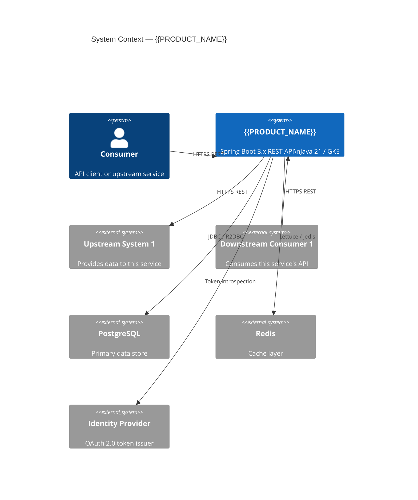
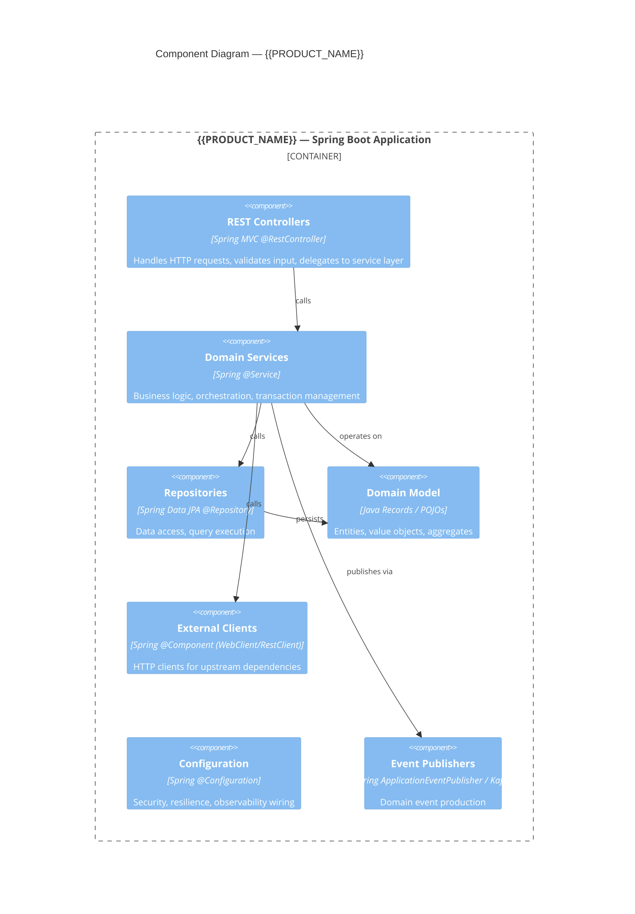

# Technical Design Document: {{PRODUCT_NAME}}

> **Spec:** [spec/spec.md](../spec.md) — must be approved before this document is generated  
> **ADRs:** [adrs/](../../adrs/) — all design decisions must have corresponding ADRs  
> **Tasks:** [spec/tasks.md](../tasks.md) — generated after this document is approved

---

## Architecture Overview

### Narrative

<!--
Describe the architecture in plain English. Explain:
- The overall architectural style (layered, hexagonal, event-driven, etc.)
- How requests flow through the system
- Key architectural boundaries and why they exist
- How this service fits into the broader system landscape
- Any notable trade-offs or deviations from standard patterns, with ADR references
-->

_Replace with architecture narrative._

### Architecture Diagram



### Component Diagram



---

## Technology Choices

| Technology | Version | Rationale | ADR Reference |
|---|---|---|---|
| Java | 21 LTS | Virtual threads (Project Loom), records, pattern matching, sealed classes; LTS support to 2031 | ADR-0001 |
| Spring Boot | 3.3.x | Native Java 21 support, Spring Security 6.x, Spring Data 3.x, Actuator improvements | ADR-0001 |
| Spring Data JPA | 3.3.x | Mature ORM abstraction; Hibernate 6.x with Jakarta EE | ADR-00XX |
| PostgreSQL | 15+ | ACID compliance, JSONB support, mature operational tooling | ADR-00XX |
| Flyway | 10.x | Schema migration; explicit version control; reproducible schema state | ADR-00XX |
| Spring Security | 6.3.x | OAuth 2.0 Resource Server; integrated with Spring Boot auto-configuration | ADR-00XX |
| Resilience4j | 2.x | Circuit breaker, retry, rate limiter; Spring Boot 3 native integration | ADR-00XX |
| Micrometer | 1.13.x | Vendor-neutral metrics; Prometheus export; distributed tracing integration | ADR-00XX |
| Testcontainers | 1.20.x | Integration tests with real DB/cache instances; no mocking of infrastructure | ADR-00XX |

### Key Dependencies (`pom.xml` excerpt)

```xml
<parent>
    <groupId>org.springframework.boot</groupId>
    <artifactId>spring-boot-starter-parent</artifactId>
    <version>3.3.x</version>
</parent>

<dependencies>
    <!-- Web Layer -->
    <dependency>
        <groupId>org.springframework.boot</groupId>
        <artifactId>spring-boot-starter-web</artifactId>
    </dependency>
    <dependency>
        <groupId>org.springframework.boot</groupId>
        <artifactId>spring-boot-starter-validation</artifactId>
    </dependency>

    <!-- Security -->
    <dependency>
        <groupId>org.springframework.boot</groupId>
        <artifactId>spring-boot-starter-security</artifactId>
    </dependency>
    <dependency>
        <groupId>org.springframework.boot</groupId>
        <artifactId>spring-boot-starter-oauth2-resource-server</artifactId>
    </dependency>

    <!-- Data Layer -->
    <dependency>
        <groupId>org.springframework.boot</groupId>
        <artifactId>spring-boot-starter-data-jpa</artifactId>
    </dependency>
    <dependency>
        <groupId>org.postgresql</groupId>
        <artifactId>postgresql</artifactId>
        <scope>runtime</scope>
    </dependency>
    <dependency>
        <groupId>org.flywaydb</groupId>
        <artifactId>flyway-core</artifactId>
    </dependency>

    <!-- Resilience -->
    <dependency>
        <groupId>io.github.resilience4j</groupId>
        <artifactId>resilience4j-spring-boot3</artifactId>
        <version>2.2.0</version>
    </dependency>

    <!-- Observability -->
    <dependency>
        <groupId>org.springframework.boot</groupId>
        <artifactId>spring-boot-starter-actuator</artifactId>
    </dependency>
    <dependency>
        <groupId>io.micrometer</groupId>
        <artifactId>micrometer-registry-prometheus</artifactId>
    </dependency>
    <dependency>
        <groupId>io.micrometer</groupId>
        <artifactId>micrometer-tracing-bridge-otel</artifactId>
    </dependency>

    <!-- Testing -->
    <dependency>
        <groupId>org.springframework.boot</groupId>
        <artifactId>spring-boot-starter-test</artifactId>
        <scope>test</scope>
    </dependency>
    <dependency>
        <groupId>org.testcontainers</groupId>
        <artifactId>postgresql</artifactId>
        <scope>test</scope>
    </dependency>
    <dependency>
        <groupId>au.com.dius.pact.provider</groupId>
        <artifactId>spring6</artifactId>
        <version>4.6.x</version>
        <scope>test</scope>
    </dependency>
</dependencies>
```

---

## Spring Boot Application Structure

### Package Layout

```
com.example.{{product}}/
├── {{ProductName}}Application.java          # Main @SpringBootApplication class
│
├── api/                                     # API Layer (controllers, DTOs, mappers)
│   ├── v1/
│   │   ├── {{Resource}}Controller.java      # @RestController — HTTP boundary only
│   │   ├── dto/
│   │   │   ├── {{Resource}}Request.java     # Input DTO (validated with @Valid)
│   │   │   └── {{Resource}}Response.java    # Output DTO
│   │   └── mapper/
│   │       └── {{Resource}}Mapper.java      # Domain ↔ DTO mapping (MapStruct)
│   └── error/
│       ├── GlobalExceptionHandler.java      # @RestControllerAdvice
│       └── ErrorResponse.java              # Standard error body record
│
├── domain/                                  # Core Domain (no framework dependencies)
│   ├── model/
│   │   ├── {{Entity}}.java                 # Domain entity / aggregate root
│   │   └── {{ValueObject}}.java            # Value objects (Java records)
│   ├── service/
│   │   ├── {{Domain}}Service.java          # Domain service interface
│   │   └── {{Domain}}ServiceImpl.java      # Implementation (Spring @Service)
│   ├── repository/
│   │   └── {{Entity}}Repository.java       # Repository interface (Spring Data)
│   └── event/
│       └── {{Entity}}CreatedEvent.java     # Domain events
│
├── infrastructure/                          # Infrastructure adapters
│   ├── persistence/
│   │   ├── entity/
│   │   │   └── {{Entity}}Jpa.java          # JPA entity (@Entity)
│   │   ├── repository/
│   │   │   └── {{Entity}}JpaRepository.java # Spring Data JPA repository
│   │   └── mapper/
│   │       └── {{Entity}}PersistenceMapper.java
│   ├── client/
│   │   └── {{UpstreamService}}Client.java  # HTTP client (Spring RestClient/WebClient)
│   └── messaging/
│       └── {{Event}}Publisher.java         # Event publisher implementation
│
└── config/                                  # Spring configuration
    ├── SecurityConfig.java                  # @Configuration — Spring Security
    ├── WebConfig.java                       # CORS, Jackson, ContentNegotiation
    ├── ResilienceConfig.java               # Resilience4j beans
    ├── ObservabilityConfig.java            # Micrometer custom meters
    └── DataSourceConfig.java               # HikariCP configuration
```

### Key Spring Annotations and Patterns

| Pattern | Annotation / Class | Usage Rule |
|---|---|---|
| REST controller | `@RestController` | One per resource; delegates to service layer only; no business logic |
| Input validation | `@Valid` + Bean Validation | Applied to all `@RequestBody` and `@PathVariable` parameters |
| Exception handling | `@RestControllerAdvice` | Single `GlobalExceptionHandler`; maps domain exceptions to HTTP responses |
| Service layer | `@Service` | Contains all business logic; manages transactions (`@Transactional`) |
| Repository | `@Repository` (via Spring Data) | Interface only; no custom SQL unless performance-critical |
| Constructor injection | `@RequiredArgsConstructor` (Lombok) or manual | Never `@Autowired` field injection |
| Transaction boundary | `@Transactional` on service methods | Not on controllers or repositories |
| Configuration | `@ConfigurationProperties` | Type-safe property binding; never `@Value` for complex config |
| Conditional beans | `@ConditionalOnProperty` | Used for optional feature flags |

### Configuration Management

**Profiles:**

| Profile | Purpose | Activation |
|---|---|---|
| `default` | Local development | `mvn spring-boot:run` |
| `test` | Integration tests | Testcontainers; `@ActiveProfiles("test")` |
| `staging` | Pre-production | `SPRING_PROFILES_ACTIVE=staging` in Harness |
| `prod` | Production | `SPRING_PROFILES_ACTIVE=prod` in Harness |

**Configuration sources (priority order, highest to lowest):**

1. GCP Secret Manager / VCF Vault (secrets only — never in configmap)
2. Kubernetes ConfigMap (`spring.config.import=configtree:/etc/config/`)
3. Environment variables
4. `application-{profile}.yaml` in classpath
5. `application.yaml` in classpath

**Key `application.yaml` structure:**

```yaml
spring:
  application:
    name: {{product-name}}
  datasource:
    url: ${DB_URL}
    username: ${DB_USERNAME}
    password: ${DB_PASSWORD}
    hikari:
      maximum-pool-size: ${DB_POOL_MAX:10}
      minimum-idle: ${DB_POOL_MIN:2}
      connection-timeout: 30000
      idle-timeout: 600000
  jpa:
    hibernate:
      ddl-auto: validate          # Flyway manages schema; Hibernate validates only
    open-in-view: false           # Disable OSIV anti-pattern
  flyway:
    locations: classpath:db/migration
    out-of-order: false

management:
  endpoints:
    web:
      exposure:
        include: health,info,prometheus,metrics
  endpoint:
    health:
      show-details: when-authorized
      probes:
        enabled: true
  tracing:
    sampling:
      probability: ${TRACE_SAMPLE_RATE:0.05}  # 5% in prod; 1.0 in staging

logging:
  pattern:
    console: "%d{ISO8601} %-5level [%X{traceId},%X{spanId}] %logger{36} - %msg%n"
```

---

## API Design Detail

> See `spec/openapi.yaml` for the authoritative OpenAPI 3.1 specification.  
> Below is a design-level summary of key decisions.

**REST conventions:**

- Resource names are plural nouns: `/api/v1/orders`, not `/api/v1/order`
- Sub-resources are nested: `/api/v1/orders/{orderId}/items`
- Actions that don't map to CRUD use verb-suffixed paths: `/api/v1/orders/{id}/cancel`
- Pagination uses cursor-based pagination (not offset) for large collections: `?cursor=<token>&limit=20`
- Partial updates use `PATCH` with JSON Merge Patch (RFC 7396); `PUT` is full replacement
- All timestamps in ISO-8601 UTC: `2026-01-15T10:30:00Z`
- All IDs are UUIDs: type 4 (random)

**Versioning strategy:**

URL path versioning (`/api/v1/`, `/api/v2/`). Breaking changes require a new major version. ADR reference: ADR-00XX.

**Controller implementation pattern:**

```java
@RestController
@RequestMapping("/api/v1/{{resources}}")
@RequiredArgsConstructor
@Tag(name = "{{Resource}} API", description = "Operations for {{resource}} management")
public class {{Resource}}Controller {

    private final {{Domain}}Service {{domain}}Service;
    private final {{Resource}}Mapper mapper;

    @GetMapping("/{id}")
    @Operation(summary = "Get {{resource}} by ID")
    public ResponseEntity<{{Resource}}Response> getById(@PathVariable UUID id) {
        return {{domain}}Service.findById(id)
            .map(mapper::toResponse)
            .map(ResponseEntity::ok)
            .orElseThrow(() -> new ResourceNotFoundException("{{Resource}}", id));
    }

    @PostMapping
    @ResponseStatus(HttpStatus.CREATED)
    public ResponseEntity<{{Resource}}Response> create(
            @Valid @RequestBody {{Resource}}Request request) {
        var created = {{domain}}Service.create(mapper.toDomain(request));
        var response = mapper.toResponse(created);
        return ResponseEntity
            .created(URI.create("/api/v1/{{resources}}/" + created.getId()))
            .body(response);
    }
}
```

---

## Data Layer Design

### Database Choice and Rationale

**Database:** PostgreSQL 15+  
**Rationale:** ADR-00XX — ACID compliance required for {{domain}} data integrity; JSONB support for flexible metadata storage; mature tooling and operational expertise.

### ORM Approach

Spring Data JPA with Hibernate 6.x. Key decisions:
- `ddl-auto: validate` — Flyway owns schema; Hibernate validates on startup
- `open-in-view: false` — prevents lazy-loading across HTTP boundary; forces explicit fetch strategies
- Projections used for read-heavy endpoints to avoid loading full aggregates
- Native queries permitted only when JPQL cannot express the query efficiently; must be documented

### Schema Migration Strategy

**Tool:** Flyway 10.x  
**Migration file location:** `src/main/resources/db/migration/`  
**Naming convention:** `V{version}__{description}.sql` (e.g., `V1__create_orders_table.sql`)

**Rules:**
- Never modify existing migration files after they are applied to any environment
- Each migration must be idempotent where possible
- Complex migrations (large data transformations) are split: schema change first, data migration second, constraint addition third
- Baseline migration `V1__baseline.sql` captures the initial schema

**Example migration:**

```sql
-- V1__create_{{entity}}_table.sql
CREATE TABLE {{entity}} (
    id          UUID         NOT NULL DEFAULT gen_random_uuid(),
    name        VARCHAR(255) NOT NULL,
    status      VARCHAR(50)  NOT NULL DEFAULT 'ACTIVE',
    metadata    JSONB,
    created_at  TIMESTAMPTZ  NOT NULL DEFAULT NOW(),
    updated_at  TIMESTAMPTZ  NOT NULL DEFAULT NOW(),
    version     BIGINT       NOT NULL DEFAULT 0,   -- optimistic locking
    CONSTRAINT pk_{{entity}} PRIMARY KEY (id),
    CONSTRAINT chk_{{entity}}_status CHECK (status IN ('ACTIVE', 'INACTIVE', 'DELETED'))
);

CREATE INDEX idx_{{entity}}_status ON {{entity}} (status);
CREATE INDEX idx_{{entity}}_created_at ON {{entity}} (created_at DESC);

-- Trigger to auto-update updated_at
CREATE OR REPLACE FUNCTION update_updated_at_column()
RETURNS TRIGGER AS $$
BEGIN
    NEW.updated_at = NOW();
    RETURN NEW;
END;
$$ language 'plpgsql';

CREATE TRIGGER trg_{{entity}}_updated_at
    BEFORE UPDATE ON {{entity}}
    FOR EACH ROW EXECUTE FUNCTION update_updated_at_column();
```

### Key Repository Patterns

```java
// Standard Spring Data JPA repository
public interface {{Entity}}Repository extends JpaRepository<{{Entity}}Jpa, UUID> {

    // Derived query — simple cases
    Optional<{{Entity}}Jpa> findByNameIgnoreCase(String name);
    
    // JPQL — when derived query becomes unreadable
    @Query("SELECT e FROM {{Entity}}Jpa e WHERE e.status = :status AND e.createdAt > :since")
    Page<{{Entity}}Jpa> findActiveCreatedAfter(
        @Param("status") String status,
        @Param("since") Instant since,
        Pageable pageable);
    
    // Projection — read-only, avoid loading full entity graph
    @Query("SELECT e.id AS id, e.name AS name, e.status AS status FROM {{Entity}}Jpa e")
    List<{{Entity}}Summary> findSummaries();
    
    // Exists check — more efficient than findById for guard clauses
    boolean existsByName(String name);
}

// Projection interface
public interface {{Entity}}Summary {
    UUID getId();
    String getName();
    String getStatus();
}
```

---

## Resilience Patterns

All resilience configuration is managed via `application.yaml` and the `resilience4j-spring-boot3` auto-configuration.

### Circuit Breaker

Applied to: all external HTTP client calls, all database operations where timeout risk exists.

```yaml
resilience4j:
  circuitbreaker:
    instances:
      {{upstream-service}}:
        sliding-window-type: COUNT_BASED
        sliding-window-size: 20
        failure-rate-threshold: 50          # Open at 50% failure rate
        wait-duration-in-open-state: 30s    # Stay open for 30s before half-open
        permitted-number-of-calls-in-half-open-state: 5
        slow-call-duration-threshold: 3s
        slow-call-rate-threshold: 80
        register-health-indicator: true
```

```java
// Usage pattern
@Service
@RequiredArgsConstructor
public class {{Domain}}ServiceImpl implements {{Domain}}Service {

    private final {{Upstream}}Client upstreamClient;

    @CircuitBreaker(name = "{{upstream-service}}", fallbackMethod = "fallback")
    @Retry(name = "{{upstream-service}}")
    @TimeLimiter(name = "{{upstream-service}}")
    public CompletableFuture<UpstreamResponse> callUpstream(String id) {
        return CompletableFuture.supplyAsync(() -> upstreamClient.get(id));
    }

    private CompletableFuture<UpstreamResponse> fallback(String id, Exception ex) {
        log.warn("Upstream fallback triggered for id={}: {}", id, ex.getMessage());
        return CompletableFuture.completedFuture(UpstreamResponse.empty());
    }
}
```

### Retry

```yaml
resilience4j:
  retry:
    instances:
      {{upstream-service}}:
        max-attempts: 3
        wait-duration: 500ms
        exponential-backoff-multiplier: 2
        retry-exceptions:
          - java.net.ConnectException
          - java.net.SocketTimeoutException
          - org.springframework.web.client.ResourceAccessException
        ignore-exceptions:
          - com.example.{{product}}.domain.exception.BusinessRuleViolationException
```

### Time Limiter (for async calls)

```yaml
resilience4j:
  timelimiter:
    instances:
      {{upstream-service}}:
        timeout-duration: 5s
        cancel-running-future: true
```

### Rate Limiter (for self-protection)

```yaml
resilience4j:
  ratelimiter:
    instances:
      api-inbound:
        limit-for-period: 100         # 100 requests per refresh period
        limit-refresh-period: 1s
        timeout-duration: 0           # Don't wait; reject immediately
```

---

## Security Design

### Spring Security Configuration

```java
@Configuration
@EnableWebSecurity
@EnableMethodSecurity
public class SecurityConfig {

    @Bean
    public SecurityFilterChain securityFilterChain(HttpSecurity http) throws Exception {
        return http
            .csrf(AbstractHttpConfigurer::disable)         // Stateless API; CSRF not applicable
            .sessionManagement(session -> session
                .sessionCreationPolicy(SessionCreationPolicy.STATELESS))
            .authorizeHttpRequests(auth -> auth
                .requestMatchers("/actuator/health", "/actuator/info").permitAll()
                .requestMatchers("/actuator/**").hasRole("INTERNAL")
                .anyRequest().authenticated())
            .oauth2ResourceServer(oauth2 -> oauth2
                .jwt(jwt -> jwt.jwtAuthenticationConverter(jwtAuthConverter())))
            .headers(headers -> headers
                .frameOptions(FrameOptionsConfig::deny)
                .contentTypeOptions(ContentTypeOptionsConfig::disable)
                .httpStrictTransportSecurity(hsts -> hsts
                    .maxAgeInSeconds(31536000)
                    .includeSubDomains(true)))
            .build();
    }

    @Bean
    public JwtAuthenticationConverter jwtAuthConverter() {
        var converter = new JwtGrantedAuthoritiesConverter();
        converter.setAuthoritiesClaimName("scope");
        converter.setAuthorityPrefix("SCOPE_");
        var authConverter = new JwtAuthenticationConverter();
        authConverter.setJwtGrantedAuthoritiesConverter(converter);
        return authConverter;
    }
}
```

### OAuth 2.0 / JWT Configuration

```yaml
spring:
  security:
    oauth2:
      resourceserver:
        jwt:
          issuer-uri: ${OAUTH2_ISSUER_URI}
          jwk-set-uri: ${OAUTH2_JWK_SET_URI}   # Override if issuer auto-discovery unavailable
```

### Secrets Management

| Secret | Storage | Access Mechanism |
|---|---|---|
| DB password | GCP Secret Manager / VCF Vault | Mounted as env var via Harness secret ref |
| JWT signing key (if self-issued) | GCP Secret Manager | Spring Cloud GCP SecretManagerPropertySource |
| API keys for upstream clients | GCP Secret Manager | Mounted as env var |
| TLS certificates | GKE managed cert / VCF cert store | Ingress controller |

---

## Observability Design

### Custom Business Metrics (Micrometer)

```java
@Component
@RequiredArgsConstructor
public class {{Domain}}Metrics {

    private final MeterRegistry meterRegistry;
    
    // Counters
    private Counter operationSuccessCounter;
    private Counter operationFailureCounter;
    
    // Timers  
    private Timer operationTimer;

    @PostConstruct
    void init() {
        operationSuccessCounter = Counter.builder("{{product}}.{{domain}}.operations.total")
            .tag("status", "success")
            .description("Total successful {{domain}} operations")
            .register(meterRegistry);
            
        operationFailureCounter = Counter.builder("{{product}}.{{domain}}.operations.total")
            .tag("status", "failure")
            .description("Total failed {{domain}} operations")
            .register(meterRegistry);
            
        operationTimer = Timer.builder("{{product}}.{{domain}}.operation.duration")
            .description("Duration of {{domain}} operation processing")
            .publishPercentiles(0.5, 0.95, 0.99)
            .register(meterRegistry);
    }
    
    public void recordSuccess(Duration duration) {
        operationSuccessCounter.increment();
        operationTimer.record(duration);
    }
    
    public void recordFailure() {
        operationFailureCounter.increment();
    }
}
```

### Logging Configuration (Logback / JSON)

```xml
<!-- logback-spring.xml -->
<configuration>
    <springProfile name="prod,staging">
        <appender name="JSON_CONSOLE" class="ch.qos.logback.core.ConsoleAppender">
            <encoder class="net.logstash.logback.encoder.LogstashEncoder">
                <includeMdcKeyName>traceId</includeMdcKeyName>
                <includeMdcKeyName>spanId</includeMdcKeyName>
                <includeMdcKeyName>requestId</includeMdcKeyName>
                <includeMdcKeyName>userId</includeMdcKeyName>
                <customFields>{"service":"{{product-name}}","environment":"${SPRING_PROFILES_ACTIVE}"}</customFields>
            </encoder>
        </appender>
        <root level="INFO">
            <appender-ref ref="JSON_CONSOLE"/>
        </root>
    </springProfile>
    <springProfile name="default,test">
        <appender name="CONSOLE" class="ch.qos.logback.core.ConsoleAppender">
            <encoder>
                <pattern>%d{HH:mm:ss.SSS} %-5level [%X{traceId}] %logger{36} - %msg%n</pattern>
            </encoder>
        </appender>
        <root level="DEBUG">
            <appender-ref ref="CONSOLE"/>
        </root>
    </springProfile>
</configuration>
```

### Distributed Tracing

```yaml
management:
  tracing:
    sampling:
      probability: ${TRACE_SAMPLE_RATE:0.05}
  otlp:
    tracing:
      endpoint: ${OTEL_EXPORTER_OTLP_ENDPOINT:http://localhost:4318/v1/traces}
```

Trace propagation uses W3C TraceContext. All inbound and outbound HTTP requests automatically carry trace headers via Spring Boot Actuator + Micrometer Tracing auto-configuration.

### Custom Health Indicators

```java
@Component
public class {{Dependency}}HealthIndicator extends AbstractHealthIndicator {

    private final {{Dependency}}Client client;

    @Override
    protected void doHealthCheck(Health.Builder builder) throws Exception {
        try {
            var status = client.ping();
            builder.up()
                .withDetail("status", status)
                .withDetail("responseTime", status.latencyMs() + "ms");
        } catch (Exception ex) {
            builder.down()
                .withException(ex)
                .withDetail("dependency", "{{Dependency}}");
        }
    }
}
```

---

## Deployment Design

### GKE Deployment _(delete if not applicable)_

**Helm chart location:** `helm/{{product-name}}/`

#### Key Helm Values (`values.yaml`)

```yaml
replicaCount: 2

image:
  repository: {{gcp-region}}-docker.pkg.dev/{{gcp-project}}/{{product-name}}
  pullPolicy: IfNotPresent
  tag: ""   # Overridden by Harness at deploy time

resources:
  requests:
    cpu: 250m
    memory: 512Mi
  limits:
    cpu: 1000m
    memory: 1024Mi

autoscaling:
  enabled: true
  minReplicas: 2
  maxReplicas: 10
  targetCPUUtilizationPercentage: 70
  targetMemoryUtilizationPercentage: 80

livenessProbe:
  httpGet:
    path: /actuator/health/liveness
    port: 8080
  initialDelaySeconds: 30
  periodSeconds: 10
  failureThreshold: 3

readinessProbe:
  httpGet:
    path: /actuator/health/readiness
    port: 8080
  initialDelaySeconds: 20
  periodSeconds: 5
  failureThreshold: 3

podDisruptionBudget:
  enabled: true
  minAvailable: 1

serviceAccount:
  create: true
  annotations:
    iam.gke.io/gcp-service-account: "{{product-name}}@{{gcp-project}}.iam.gserviceaccount.com"
```

#### GKE Network Policy

```yaml
# Restrict ingress to ingress controller and monitoring namespace only
apiVersion: networking.k8s.io/v1
kind: NetworkPolicy
metadata:
  name: {{product-name}}-netpol
spec:
  podSelector:
    matchLabels:
      app: {{product-name}}
  policyTypes:
    - Ingress
    - Egress
  ingress:
    - from:
        - namespaceSelector:
            matchLabels:
              kubernetes.io/metadata.name: ingress-nginx
    - from:
        - namespaceSelector:
            matchLabels:
              kubernetes.io/metadata.name: monitoring
      ports:
        - port: 8080
  egress:
    - to:
        - namespaceSelector: {}
      ports:
        - port: 5432   # PostgreSQL
        - port: 6379   # Redis
        - port: 443    # External HTTPS
```

### VCF (VMware) Deployment _(delete if not applicable)_

| Parameter | Value |
|---|---|
| VM template | RHEL 9 minimal + OpenJDK 21 golden image |
| vCPU | |
| RAM (GB) | |
| OS disk (GB) | 60 |
| Data volume (GB) | |
| Network segment | |
| Deployment tooling | Harness delegate → Ansible playbook |
| Ansible role | `pdlc.springboot-service` |
| Service management | systemd |
| Log shipping | Filebeat → Elasticsearch |

### Harness Pipeline Stages

```yaml
# .harness/pipeline.yaml
pipeline:
  name: {{product-name}}-deploy
  identifier: {{product_name}}_deploy
  projectIdentifier: {{harness-project}}
  orgIdentifier: {{harness-org}}
  stages:
    - stage:
        name: Build & Test
        identifier: build_test
        type: CI
        spec:
          cloneCodebase: true
          execution:
            steps:
              - step:
                  type: Run
                  name: Unit Tests
                  spec:
                    command: mvn test -Punit
              - step:
                  type: Run
                  name: Integration Tests
                  spec:
                    command: mvn test -Pintegration
              - step:
                  type: Run
                  name: Architectural Lint
                  spec:
                    command: arch-lint --adrs-dir ./adrs --fail-on-violation
              - step:
                  type: Run
                  name: Build Image
                  spec:
                    command: |
                      mvn package -DskipTests
                      docker build -t ${IMAGE_NAME}:${BUILD_NUMBER} .
                      docker push ${IMAGE_NAME}:${BUILD_NUMBER}

    - stage:
        name: Deploy Staging
        identifier: deploy_staging
        type: Deployment
        spec:
          deploymentType: Kubernetes
          service:
            serviceRef: {{product-name}}
          environment:
            environmentRef: staging
          execution:
            steps:
              - step:
                  type: HelmDeploy
                  name: Helm Deploy Staging
                  spec:
                    releaseName: {{product-name}}-staging
                    chartPath: helm/{{product-name}}
              - step:
                  type: Run
                  name: Smoke Tests
                  spec:
                    command: mvn test -Psmoke -Dbase.url=${STAGING_URL}

    - stage:
        name: Approve Production
        identifier: approve_prod
        type: Approval
        spec:
          execution:
            steps:
              - step:
                  type: HarnessApproval
                  name: Production Approval
                  spec:
                    approvers:
                      userGroups:
                        - tech-leads
                    approvalMessage: |
                      Deploying {{product-name}} version ${BUILD_NUMBER} to production.
                      Staging smoke tests: PASSED
                      Please review and approve.

    - stage:
        name: Deploy Production
        identifier: deploy_prod
        type: Deployment
        spec:
          deploymentType: Kubernetes
          service:
            serviceRef: {{product-name}}
          environment:
            environmentRef: production
          execution:
            steps:
              - step:
                  type: HelmDeploy
                  name: Helm Deploy Production
                  spec:
                    releaseName: {{product-name}}-prod
                    chartPath: helm/{{product-name}}
                    canary: true
                    canaryPercentage: 10
```

---

## Known Design Risks and Mitigations

| Risk | Likelihood | Impact | Mitigation |
|---|---|---|---|
| Upstream service unavailability cascades to this service | Medium | High | Circuit breaker + graceful degradation fallback (see Resilience Patterns) |
| Schema migration failure blocks deployment | Low | High | Flyway `outOfOrder: false`; migration tested in staging before prod; rollback plan in runbook |
| JVM memory pressure under peak load | Medium | Medium | Explicit resource limits; G1GC tuning; heap monitoring alert at 80% |
| Optimistic lock conflicts under concurrent writes | Medium | Low | Retry at service layer for `OptimisticLockException`; max 3 retries |
| Token validation latency if IdP is slow | Low | Medium | Cache JWKS with TTL; fallback to cached public key if IdP unreachable |
| | | | |

---

*Template version: 1.0 | Framework: PDLC 1.0*
