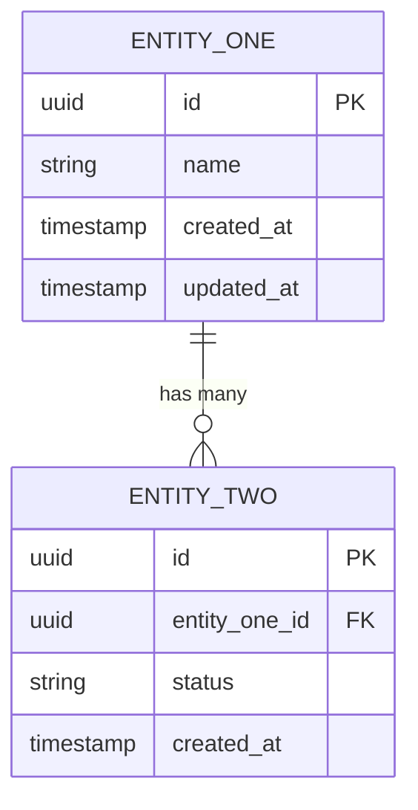

# Functional and Non-Functional Specification: {{PRODUCT_NAME}}

> **Proposal:** [spec/proposal.md](../proposal.md)  
> **Design:** [spec/design.md](../design.md) _(generated after this spec is approved)_  
> **ADRs:** [adrs/](../../adrs/)  
> **Tasks:** [spec/tasks.md](../tasks.md)

---

## Executive Summary

<!--
2–4 paragraphs summarising what this product is, what it replaces or enables, and why it matters.
Written for a technical reader who hasn't seen the proposal. Include:
- Product purpose and primary users
- Key capabilities being delivered
- Critical constraints or risks
- How this product fits into the broader system landscape
-->

_Replace with executive summary._

---

## Functional Requirements

<!--
Each requirement follows the format:
  FR-NNN: [Present-tense verb] [Subject] [so that/to enable] [Outcome]
  - Acceptance Criteria: numbered, independently testable conditions

Requirements are numbered sequentially. When requirements are deleted or deprecated,
their numbers are NOT reused — they are marked DEPRECATED.
-->

### FR-001: [Requirement Title]

**Description:** _One sentence describing what the system must do._

**User/System:** _Who or what triggers this behaviour?_

**Acceptance Criteria:**
1. _Condition that must be true for this requirement to be considered met_
2. _Additional testable condition_
3. _Edge case condition_

**Spec notes:** _Any nuance, known complexity, or disambiguation notes._

---

### FR-002: [Requirement Title]

**Description:**

**User/System:**

**Acceptance Criteria:**
1.
2.

---

### FR-003: [Requirement Title]

**Description:**

**User/System:**

**Acceptance Criteria:**
1.
2.

---

<!-- Add FR-NNN sections as needed. All requirements from the proposal must be represented. -->

---

## Non-Functional Requirements

### NFR-PERF: Performance

| Metric | Target | Measurement Condition | Breach Action |
|---|---|---|---|
| Latency p50 | `≤ ___ ms` | At ___ RPS sustained | Alert + investigate |
| Latency p95 | `≤ ___ ms` | At ___ RPS sustained | Alert + page on-call |
| Latency p99 | `≤ ___ ms` | At ___ RPS sustained | Alert + auto-scale |
| Throughput | `___ RPS` | Peak sustained over 5 min | — |
| Startup time | `≤ ___ s` | Cold start to ready | Fail health check if exceeded |
| Memory ceiling | `≤ ___ MB` | Per pod / per VM | OOM kill → restart |
| GC pause budget | `≤ ___ ms` | Max STW pause (G1GC) | Alert if exceeded |

**JVM Tuning Notes:**

```
# Baseline JVM flags for Java 21 (GKE pod / VCF VM)
-XX:+UseG1GC
-XX:MaxRAMPercentage=75.0
-XX:InitialRAMPercentage=50.0
-Djava.security.egd=file:/dev/./urandom
-XX:+ExitOnOutOfMemoryError
```

---

### NFR-AVAIL: Availability

| Metric | Target | Notes |
|---|---|---|
| Service SLA (uptime) | `___%` | Measured monthly, excluding planned maintenance |
| RTO (Recovery Time Objective) | `≤ ___ min` | Time to restore after failure |
| RPO (Recovery Point Objective) | `≤ ___ min` | Max acceptable data loss |
| Planned maintenance window | | e.g., Sun 02:00–04:00 UTC |
| Circuit breaker open threshold | `___% errors in ___ s` | Resilience4j config |
| Health check endpoint | `GET /actuator/health` | Spring Boot Actuator |
| Readiness probe | | Path and threshold |
| Liveness probe | | Path and threshold |

---

### NFR-SEC: Security

| Concern | Requirement | Standard / Reference |
|---|---|---|
| **Authentication** | | e.g., OAuth 2.0 Bearer Token |
| **Authorisation** | | e.g., Scope-based, RBAC |
| **Token issuer** | | e.g., internal IdP, Auth0 |
| **Data classification** | | Internal / Confidential / Restricted / PII |
| **Encryption at rest** | | AES-256 / managed key |
| **Encryption in transit** | | TLS 1.2 minimum; TLS 1.3 preferred |
| **Secrets management** | | GCP Secret Manager / VCF Vault |
| **Input validation** | All inputs validated at API boundary | Spring Validation (@Valid) |
| **Output encoding** | | JSON serialisation, no raw HTML |
| **PII handling** | | Masking policy, retention policy |
| **Audit log** | | Which events, what fields, retention |
| **Vulnerability scanning** | | e.g., Snyk / Trivy in Harness pipeline |

**Spring Security Configuration Requirements:**

- CSRF: disabled for stateless REST API (JWT-authenticated); enabled for MVC/session-based
- CORS: explicitly configured — no wildcard origins in production
- Security headers: `X-Frame-Options: DENY`, `X-Content-Type-Options: nosniff`, `Strict-Transport-Security`
- Actuator endpoints: `/actuator/health` and `/actuator/info` public; all others require internal auth

---

### NFR-SCALE: Scalability

**Deployment target:** `GCP GKE` | `VMware VCF` _(delete as appropriate)_

#### GKE (Kubernetes) Scaling Policy

| Parameter | Value | Notes |
|---|---|---|
| Minimum replicas | | |
| Maximum replicas | | |
| HPA target CPU | `___%` | |
| HPA target memory | `___%` | |
| HPA scale-up stabilisation | `___ s` | |
| HPA scale-down stabilisation | `___ s` | |
| Pod Disruption Budget (min available) | | |
| Resource request CPU | `___ m` | |
| Resource request memory | `___ Mi` | |
| Resource limit CPU | `___ m` | |
| Resource limit memory | `___ Mi` | |

#### VCF (VMware) Scaling Policy

| Parameter | Value |
|---|---|
| VM sizing (vCPU) | |
| VM sizing (RAM GB) | |
| Scale-out trigger | |
| Maximum VM count | |
| Storage volume size | |

---

### NFR-OBS: Observability

#### Required Metrics (Micrometer)

All metrics exposed at `/actuator/prometheus` via Spring Boot Actuator + Micrometer.

| Metric Name | Type | Labels | Description |
|---|---|---|---|
| `http.server.requests` | Timer | `uri`, `method`, `status` | Auto-provided by Spring Boot |
| `jvm.memory.used` | Gauge | `area` | Auto-provided |
| `jvm.gc.pause` | Timer | `action`, `cause` | Auto-provided |
| `db.pool.connections` | Gauge | `state` | HikariCP auto-provided |
| `{{product}}.{{domain}}.operations.total` | Counter | `operation`, `status` | **Custom business metric** |
| `{{product}}.{{domain}}.processing.time` | Timer | `operation` | **Custom business metric** |

#### Logging Format

All log output must be structured JSON. Required MDC fields:

```json
{
  "timestamp": "ISO-8601",
  "level": "INFO|WARN|ERROR|DEBUG",
  "logger": "com.example.product.ClassName",
  "message": "Human-readable log message",
  "traceId": "W3C trace-id",
  "spanId": "W3C span-id",
  "requestId": "UUID per HTTP request",
  "userId": "masked or anonymised user identifier",
  "productName": "{{product_name}}",
  "environment": "dev|staging|prod",
  "serviceVersion": "{{version}}"
}
```

**Logging rules:**
- `ERROR`: system errors requiring human attention; always include stack trace
- `WARN`: degraded operation; service continues but with reduced capability
- `INFO`: key business events (request received, order processed, etc.) — not every line
- `DEBUG`: detailed diagnostic; disabled in production by default

#### Distributed Tracing

| Parameter | Value |
|---|---|
| Provider | GCP Cloud Trace / Zipkin / Jaeger |
| Instrumentation | Spring Boot Actuator + Micrometer Tracing + OpenTelemetry |
| Sampling rate (production) | `___ %` (e.g., 5%) |
| Sampling rate (staging) | `100%` |
| Propagation format | W3C TraceContext |
| Required trace attributes | `product_name`, `service_version`, `deployment_env` |

#### Health Indicators

| Endpoint | Purpose | Included Indicators |
|---|---|---|
| `GET /actuator/health` | Liveness + Readiness | DB, disk space, custom |
| `GET /actuator/health/liveness` | K8s liveness probe | Application state only |
| `GET /actuator/health/readiness` | K8s readiness probe | DB connectivity, dependencies |
| `GET /actuator/info` | Build and version info | Git commit, build time |
| `GET /actuator/prometheus` | Metrics scrape | All Micrometer metrics |

---

### NFR-COMP: Compliance

| Regulation / Framework | Applies? | Requirement |
|---|---|---|
| GDPR | Yes / No | Data subject rights, breach notification, DPA |
| Data residency | Yes / No | Region restriction: ___ |
| PCI-DSS | Yes / No | Cardholder data scope |
| ISO 27001 | Yes / No | Audit log retention |
| Internal Data Policy | Yes | Link to internal policy doc |

**Data Retention Policy:**

| Data Type | Retention Period | Deletion Mechanism |
|---|---|---|
| | | |

**GDPR Data Subject Rights (if applicable):**

| Right | Implementation Approach |
|---|---|
| Right to Access | |
| Right to Erasure | |
| Right to Portability | |
| Right to Rectification | |

---

## API Contract

> ⚠️ **Applicable to service_type: api and microservice only.** Delete this section for monolith or data-pipeline.

**OpenAPI Specification:** `spec/openapi.yaml` _(generated from this spec; authoritative contract)_

**Base path:** `/api/v1`  
**Content type:** `application/json`  
**Authentication:** Bearer token in `Authorization` header (see NFR-SEC)

### Endpoint Summary

| Method | Path | Description | Auth Required | Rate Limit |
|---|---|---|---|---|
| `GET` | `/api/v1/{{resource}}` | List resources | ✅ | ___ RPS |
| `GET` | `/api/v1/{{resource}}/{id}` | Get resource by ID | ✅ | — |
| `POST` | `/api/v1/{{resource}}` | Create resource | ✅ | ___ RPS |
| `PUT` | `/api/v1/{{resource}}/{id}` | Update resource | ✅ | — |
| `DELETE` | `/api/v1/{{resource}}/{id}` | Delete resource | ✅ | — |

### Request/Response Schemas

#### `POST /api/v1/{{resource}}` — Create Request

```json
{
  "fieldName": "string (required, max 255 chars)",
  "anotherField": "integer (required, min 0)",
  "optionalField": "string (optional, ISO-8601 date)"
}
```

#### `GET /api/v1/{{resource}}/{id}` — Success Response (200)

```json
{
  "id": "UUID",
  "fieldName": "string",
  "anotherField": 0,
  "createdAt": "ISO-8601 datetime",
  "updatedAt": "ISO-8601 datetime",
  "_links": {
    "self": { "href": "/api/v1/{{resource}}/{id}" }
  }
}
```

#### Error Response Schema (all endpoints)

```json
{
  "timestamp": "ISO-8601",
  "status": 400,
  "error": "Bad Request",
  "message": "Human-readable error description",
  "path": "/api/v1/{{resource}}",
  "requestId": "UUID",
  "violations": [
    {
      "field": "fieldName",
      "message": "must not be blank"
    }
  ]
}
```

### Standard HTTP Status Codes

| Status | Used For |
|---|---|
| `200 OK` | Successful GET, PUT |
| `201 Created` | Successful POST (with `Location` header) |
| `204 No Content` | Successful DELETE |
| `400 Bad Request` | Validation failure |
| `401 Unauthorized` | Missing or invalid token |
| `403 Forbidden` | Valid token, insufficient scope |
| `404 Not Found` | Resource not found |
| `409 Conflict` | Duplicate resource or state conflict |
| `422 Unprocessable Entity` | Business rule violation |
| `429 Too Many Requests` | Rate limit exceeded |
| `500 Internal Server Error` | Unexpected error (opaque to client) |
| `503 Service Unavailable` | Dependency failure / circuit open |

---

## Data Model

### Key Entities

| Entity | Description | Storage | Notes |
|---|---|---|---|
| `{{Entity1}}` | | PostgreSQL | Primary aggregate root |
| `{{Entity2}}` | | PostgreSQL | |

### Entity Relationships



### Storage Technology

| Concern | Technology | Rationale |
|---|---|---|
| Primary data store | | e.g., PostgreSQL 15 — ACID, existing operational expertise |
| Cache | | e.g., Redis — session/hot-path caching |
| Blob storage | | e.g., GCS — document storage |
| Search | | e.g., N/A |

### Data Ownership

This service is the **system of record** for: _(list entities)_

This service **reads from but does not own**: _(list entities and their authoritative sources)_

---

## Event Model

> **Applicable if the service produces or consumes events.** Delete this section if not applicable.

### Events Produced

| Event Name | Topic | Schema Version | When Emitted | Consumers |
|---|---|---|---|---|
| `{{ProductName}}.{{EntityName}}.Created` | `{{product}}-events` | v1 | On successful create | |

### Events Consumed

| Event Name | Topic | Schema Version | Action Taken |
|---|---|---|---|
| | | | |

### Event Schema (CloudEvents format)

```json
{
  "specversion": "1.0",
  "type": "com.example.{{product}}.{{entity}}.created",
  "source": "/{{product}}/api/v1/{{entity}}",
  "id": "UUID",
  "time": "ISO-8601",
  "datacontenttype": "application/json",
  "data": {
    "entityId": "UUID",
    "eventType": "CREATED",
    "payload": {}
  }
}
```

---

## Error Handling Strategy

### Principles

1. **Never leak internal details to external callers** — all 5xx responses return the standard error schema with a `requestId` for correlation; stack traces go to the log only.
2. **Be precise with 4xx codes** — use the most specific status code available; avoid generic `400` when `409` or `422` is more accurate.
3. **Fail fast at the boundary** — validate all inputs at the API/consumer boundary using Bean Validation (`@Valid`); do not propagate invalid data into the service layer.
4. **Retryable vs non-retryable** — all 5xx errors include a `Retry-After` header if the error is transient. 4xx errors do not — they require client action.
5. **Structured exception hierarchy** — exceptions follow the domain package: `DomainException` → `ResourceNotFoundException`, `BusinessRuleViolationException`, `DependencyException`.

### Exception to HTTP Status Mapping

| Exception Class | HTTP Status | Retryable |
|---|---|---|
| `ResourceNotFoundException` | 404 | No |
| `BusinessRuleViolationException` | 422 | No |
| `DuplicateResourceException` | 409 | No |
| `ValidationException` (Bean Validation) | 400 | No |
| `UnauthorizedException` | 401 | No |
| `InsufficientScopeException` | 403 | No |
| `DependencyUnavailableException` | 503 | Yes |
| `RateLimitExceededException` | 429 | Yes |
| `Throwable` (catch-all) | 500 | Unknown |

---

## Deployment Target

### GCP GKE _(delete if not applicable)_

| Parameter | Value |
|---|---|
| Cluster | |
| Namespace | |
| Region | |
| Ingress | GKE Gateway API / Cloud Load Balancer |
| Service type | ClusterIP (internal) / LoadBalancer (external) |
| Image registry | GCP Artifact Registry |
| Config source | GKE ConfigMap + GCP Secret Manager |

### VMware VCF _(delete if not applicable)_

| Parameter | Value |
|---|---|
| Environment | |
| vSphere cluster | |
| Network segment | |
| Storage policy | |
| Deployment mechanism | Harness delegate → Ansible / Terraform |

---

## Dependency Contracts

### What This Service Depends On

| Dependency | Protocol | Criticality | Fallback Strategy |
|---|---|---|---|
| | | Hard / Soft | Circuit break / cache / degrade |

### What This Service Guarantees to Dependents

| Consumer | Guarantee | SLA | Breaking Change Policy |
|---|---|---|---|
| | | | Minimum ___ days notice, major version bump |

---

## Test Strategy

| Test Type | Tool / Framework | Coverage Target | What Is Tested |
|---|---|---|---|
| Unit | JUnit 5 + Mockito | ≥ 80% line coverage | Domain logic, service layer, mappers |
| Integration | Spring Boot Test + Testcontainers | Key integration paths | DB, cache, external HTTP calls |
| API / Contract | Spring MVC Test + Pact | All endpoints | Request/response schema, HTTP status codes |
| End-to-End | Postman / RestAssured + staging env | Critical user journeys | Happy path + primary error paths |
| Performance | Gatling | p95 latency target | Peak load scenario |
| Security | OWASP ZAP (in Harness pipeline) | OWASP Top 10 | Automated DAST scan |

**Test data strategy:** _(describe how test data is managed — seed scripts, factories, Testcontainers reset)_

**CI gate:** PRs must pass unit + integration tests. Contract tests run on merge to main. E2E runs pre-production deployment.

---

## Migration Strategy

> **Complete this section if this product replaces an existing system.** Delete if greenfield with no migration.

### Migration Approach

| Phase | Description | Rollback Plan |
|---|---|---|
| Phase 1: Shadow mode | New service receives traffic but responses are discarded | Disable shadow routing |
| Phase 2: Canary | N% of traffic routed to new service | Reduce canary weight to 0 |
| Phase 3: Cutover | 100% traffic to new service | Re-route to old service |
| Phase 4: Decommission | Old service retired | N/A — point of no return |

### Data Migration

| Data set | Migration mechanism | Validation approach |
|---|---|---|
| | | |

---

## Spec Review Checklist

> Complete before setting `status: reviewed`. The Architect Agent uses this checklist during generation; human reviewers must re-validate before approval.

### Architectural Integrity

- [ ] All functional requirements are traceable to the proposal
- [ ] No requirement conflicts with an accepted ADR
- [ ] API contract is complete — no `TBD` endpoints, schemas or status codes
- [ ] Data model covers all entities referenced in functional requirements
- [ ] All integration points are covered in Dependency Contracts

### Completeness

- [ ] All NFR fields have numeric targets (not adjectives)
- [ ] Security section specifies auth mechanism, data classification, encryption standards
- [ ] Deployment target is specified with cluster/namespace/environment detail
- [ ] Test strategy covers all four test types with coverage targets
- [ ] Error handling strategy covers all error categories

### Machine-Readability (Agent Use)

- [ ] YAML frontmatter is complete and valid
- [ ] All requirement IDs (FR-NNN) are unique and sequential
- [ ] All table entries have values (no blank cells in required tables)
- [ ] Metric names follow the `{{product}}.{{domain}}.{{measurement}}` convention
- [ ] All referenced files (proposal, ADRs, design) exist or have placeholder paths

### Human Approval

| Role | Name | Date | Decision |
|---|---|---|---|
| **Reviewing Architect** | | | Approved / Returned |
| **Product Owner** | | | Approved / Returned |

---

*Template version: 1.0 | Framework: PDLC 1.0*
